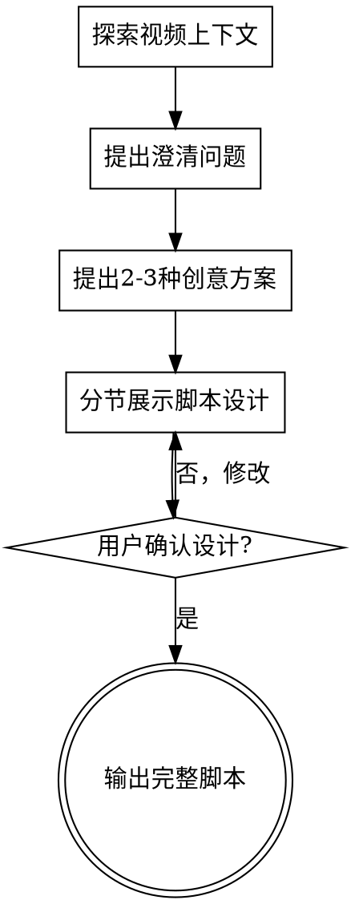

# 短视频脚本撰写技能

<HARD-GATE>
在撰写完整脚本之前，必须先通过头脑风暴流程探索用户意图、创意方向和内容策略。不要直接跳到脚本输出。
</HARD-GATE>

## 头脑风暴流程

每次撰写脚本前，按顺序完成以下步骤：

### 1. 探索视频上下文

首先了解：
- 你之前拍过什么视频？（查看历史内容确保风格一致）
- 你的账号定位是什么？（技术教程、工具测评、职场干货...）
- 最近什么内容数据好？（分析成功案例）

### 2. 提出澄清问题

<EXTREMELY-IMPORTANT>
**必须使用 内置提问 工具提问！**
不要用纯文本对话提问。每次提问都必须使用 内置提问 工具弹出对话框。
一次只问一个问题，等待用户回答后再问下一个。
</EXTREMELY-IMPORTANT>

使用 内置提问 工具时：
- 将问题拆分为 2-4 个可选项供用户选择
- 每个选项要有清晰的标签和说明
- 优先使用选择题而非开放式问题
- 允许用户选择"Other"提供自定义输入

重点理解：

**目标导向：**
- 这个视频想达到什么效果？（涨粉、卖课、带货、建立专业形象？）
- 成功指标是什么？（完播率、收藏数、转化？）

**受众画像：**
- 你的观众是谁？（小白、进阶用户、老板、学生？）
- 他们最关心什么？（省时间、省钱、学技能、避坑？）

**内容定位：**
- 你想讲什么？（工具推荐、教程分享、行业资讯、实战案例？）
- 有没有具体的主题/产品？（不知道我可以帮你选题）

**形式约束：**
- 视频多长？（15秒快闪 / 60秒干货 / 3分钟深度）
- 拍摄形式？（口播、录屏、混合、情景剧？）

**观众价值：**
- 观众看完能立即得到什么？（具体可量化的收益）
- 这个价值对观众有多重要？（刚需、锦上添花、新鲜好奇？）
- 不看这个视频会失去什么？（机会成本、时间损失、踩坑风险？）

**行动指引：**
- 观众看完后具体要做什么？（下载工具、收藏备用、转发给某人、立即尝试？）
- 行动的门槛有多高？（一键搞定 / 需要注册 / 需要学习成本？）
- 如何让行动更有吸引力？（限时福利、独家资源、规避风险？）

### 3. 提出 2-3 种创意方案

针对你的主题，提供不同角度的内容方案：
- 方案A：对比强烈（"用A的都在换B了"）
- 方案B：结果前置（先展示惊艳效果）
- 方案C：故事化（从痛点到解决方案）

每个方案附带：
- 适用场景
- 预期效果
- 推荐理由

### 4. 展示脚本设计

获得方案确认后，分节展示脚本结构：
- 开头钩子设计
- 内容主体结构
- CTA（行动号召）设计

每节展示后获得确认，再继续下一节。

### 5. 输出完整脚本

设计确认后，输出符合标准格式的完整脚本。

## 流程图



---

## 核心原则：用户不关心技术，只关心"这对我有什么用"

写脚本时永远先问：观众看完能得到什么？
- ✅ "这个工具帮你每天省2小时"
- ❌ "这个工具用的是GPT-4架构"

---

## 快速开始参考

如果你已经很明确要拍什么，可以直接告诉我：

1. **你想达到什么效果？**
   - 涨粉？卖课？带货？建立专业形象？

2. **你的观众是谁？**
   - 小白需要"有手就会"
   - 进阶用户需要"干货技巧"
   - 老板需要"降本增效"

3. **你想讲什么？**（不知道的话我可以帮你选题）
   - 工具推荐、教程分享、行业资讯、实战案例

4. **视频多长？**
   - 15秒快闪 / 60秒干货 / 3分钟深度

---

## 爆款开头钩子（7种让观众停下来的方式）

不管你做什么内容，这些开头都能抓住观众：

| 编号 | 钩子类型 | 适用场景 | 模板公式 | 示例 |
|------|---------|----------------|----------|------|
| 1 | 颠覆认知 | 新方法/新工具 | `还在用XX做XX？现在都用XX了` | "还在手动写文案？这个工具3秒就搞定" |
| 2 | 数字震撼 | 效率对比/成果展示 | `原来X小时，现在X分钟` | "原本1天的工作，现在5分钟搞定" |
| 3 | 焦虑共鸣 | 职场/技能焦虑 | `还在担心XX？` | "打工人必看：这3个技能永远保值" |
| 4 | 内幕揭秘 | 行业资讯/深度解读 | `大厂都在偷偷用的...` | "大厂内部员工都在用的工作技巧" |
| 5 | 零门槛承诺 | 教程类内容 | `不用会XX/不用花钱` | "0基础！手把手教你做出XX效果" |
| 6 | 结果前置 | 工具测评/案例展示 | 先展示最终惊艳效果 | 【视频】先看结果，再告诉你怎么做 |
| 7 | 对比冲突 | 工具对比/新旧对比 | `A和B到底哪个...` | "实测：同样的需求，A和B谁更强" |

### 高转化关键词

开头3秒尽量包含这些词：
- 效率类：「3秒」「一键」「自动」「免费」「懒人」
- 效果类：「惊艳」「封神」「王炸」「绝了」「逆天了」
- 门槛类：「0基础」「小白」「手残党」「有手就会」
- 身份类：「打工人」「学生党」「自媒体」「老板」

---

## 内容类型脚本模板

### 类型一：工具/方法测评推荐

适合时长：**60秒**

```
[0-3s]   Hook：颠覆认知型钩子（"还在用XX？现在都用XX了"）
[3-8s]   痛点放大：传统方式有多麻烦
[8-15s]  解决方案亮相：名称+一句话定位
[15-40s] 效果展示：如何解决这个痛点（配演示/操作画面）
[40-50s] 行动建议：观众具体应该怎么做
[50-55s] 客观提醒：说一句局限（增加可信度）
[55-60s] CTA：「评论区领链接/关注获取更多」
```

**台词特点**：
- 不说"这个工具非常好用"，说"直接省了我3小时"
- 不说"功能很强大"，说"这效果我直接跪了"
- 演示时配合"你看""注意看""重点来了"等引导词

---

### 类型二：教程/实操指南

适合时长：**3分钟**（可分上下集）

```
[0-3s]     Hook：零门槛承诺（"0基础做出XX"）或结果前置
[3-15s]    成果展示：先看最终能做出什么效果
[15-30s]   适用场景：这个技能能帮你解决什么问题
[30-90s]   第一步：准备工作（配演示）
[90-150s]  第二步：核心步骤讲解（关键操作放大展示）
[150-165s] 第三步：测试运行/效果验证
[165-170s] 总结：核心步骤回顾
[170-175s] CTA：「点赞收藏，跟着做」「有问题评论区见」
[175-180s] 下期预告（可选）
```

**台词特点**：
- 每一步开头加"首先/然后/最后"
- 关键操作配"注意这里""划重点"
- 常见错误提前说："很多人会卡在这一步..."
- 不说专业术语，说"照着填这几个地方"

---

### 类型三：行业资讯/趋势解读

适合时长：**60秒**

```
[0-3s]   Hook：内幕揭秘型（"大厂都在偷偷..."）或颠覆认知
[3-10s]  事件陈述：一句话说清楚发生了什么事
[10-25s] 核心影响：对用户/行业有什么实际影响
[25-45s] 深度解读：你的独特观点/预测
[45-55s] 行动建议：观众应该怎么做（现在学？观望？）
[55-60s] CTA：「关注获取最新资讯」
```

**台词特点**：
- 用"简单来说""翻译成人话"把术语通俗化
- 预测类内容加"我的判断是..."建立专业人设
- 不说"我认为"，说"圈内都在传"

---

### 类型四：15秒快闪（新方法速递/一句话干货）

```
[0-3s]   Hook：数字震撼或颠覆认知
[3-12s]  核心信息：是什么+一个最牛的特点
[12-15s] CTA：「关注，持续分享」
```

---

## 台词表达技巧

### 术语转化表（把"黑话"变成"人话"）

| 不说（太专业） | 改说（接地气） |
|---------------|---------------|
| 大语言模型 | AI大脑/AI模型 |
| Prompt | 指令/提示词 |
| API调用 | 接入/对接 |
| 工作流 | 自动化流程 |
| 调参 | 调整设置 |
| 字数额度 | 字数/计算单位 |
| 胡说八道 | 一本正经地编 |

> 原则：观众听得懂，才愿意看下去

### 人设塑造建议

根据你的定位选择话术风格：

**实用派**（推荐）：
- "亲测有效"
- "我自己每天都在用"
- "直接上干货"

**先行者**：
- "圈内人才知道"
- "提前布局"
- "信息差就是机会"

**技术流**：
- 适当保留专业术语，但每说一个都要解释
- "从原理上讲..."
- "底层逻辑是..."

---

## 脚本写作规范

### 语言节奏

- **语速**：每秒3-4个字
- **短句为主**：每句10-15字，一行一个信息点
- **留白设计**：关键点后停顿，给观众反应时间

### 字数参考

| 时长 | 建议字数 | 适合内容 |
|------|---------|---------|
| 15秒 | 45-60字 | 新工具快闪 |
| 60秒 | 180-240字 | 工具测评、资讯解读 |
| 3分钟 | 540-720字 | 深度教程、搭建指南 |

---

## 标准脚本输出格式

```markdown
## 视频脚本：[标题]

### 基本信息
- 内容类型：工具测评/教程指南/行业资讯
- 时长：X秒
- 目标人群：小白/进阶用户/专业人士
- 核心卖点：一句话总结价值

### 分镜脚本

| 时间 | 画面 | 台词/字幕 | 音效/备注 |
|------|------|----------|----------|
| 0-3s | 博主面对镜头/界面特写 | 【钩子台词】 | BGM渐入，节奏感强 |
| 3-Xs | [具体画面描述] | [台词] | [演示/操作/特效] |
| ... | ... | ... | ... |

### 字幕重点
- 需加粗关键词：
- 需变色强调：
- 需加特效字：

### 拍摄/制作提示
- 机位建议：
- 录屏区域：
- 关键操作特写：
- BGM风格：
```

---

## 工作流程

1. **明确目标** → 你想达到什么效果？
2. **选择钩子** → 从7种钩子中选择最适合的
3. **套用模板** → 按内容类型填充结构
4. **撰写台词** → 口语化、短句、用人话说
5. **设计画面** → 配合演示/展示
6. **检查节奏** → 确保字数符合时长
7. **添加CTA** → 引导关注/评论/收藏

---

## 进阶参考

- [短视频脚本撰写完整指南](references/short-video-script-guide.md) - 通用短视频技巧补充
