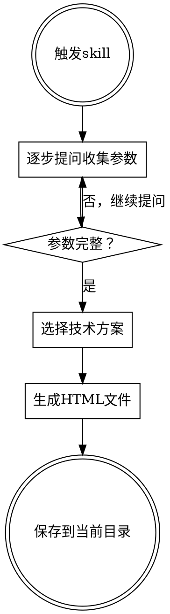

# Puppeteer动画生成器

## 概述

通过交互式头脑风暴引导用户创建符合Puppeteer要求的透明背景HTML动画。逐步收集参数后生成完整的动画文件，支持纯CSS、CSS+JS、Anime.js等多种技术方案。

**核心原则：** 一步步问清楚需求，生成可立即使用的动画HTML文件。

## 触发条件

- 用户说"创建动画"、"生成动画"、"做个动画效果"
- 用户提到"Puppeteer动画"或"透明背景动画"
- 用户需要视频叠加动画效果

## 工作流程



## 头脑风暴问题序列

<HARD-GATE>
必须按照以下顺序逐个提问，每个问题提供多选项。只有收集完所有参数后才能开始生成动画。
</HARD-GATE>

### 问题清单（按顺序逐个提问）

| 序号 | 问题 | 选项 |
|------|------|------|
| 1 | **动画类型** | A. 文字动画 / B. 图形动画 / C. 组合动画 |
| 2 | **主题/用途** | A. 视频标题 / B. 字幕 / C. 转场 / D. Logo展示 / E. 装饰效果 / F. 其他 |
| 3 | **风格** | A. 现代 / B. 科技感 / C. 可爱 / D. 极简 / E. 复古 / F. 华丽 / G. 其他 |
| 4 | **时长** | A. 3秒 / B. 5秒 / C. 10秒 / D. 自定义 |
| 5 | **尺寸** | A. 1920×1080（横屏） / B. 1080×1920（竖屏） / C. 800×600 / D. 自定义 |
| 6 | **背景透明** | A. 是（透明背景） / B. 否（需要背景色） |
| 7 | **配色方案** | 根据风格推荐或让用户自定义 |
| 8 | **动画细节** | 根据动画类型动态提问（见下方详细说明） |
| 9 | **循环方式** | A. 单次播放 / B. 循环播放 / C. 播放后保持最终状态 |
| 10 | **文件名** | 默认根据主题生成，可修改 |

### 动画细节问题（根据类型动态提问）

#### 文字动画类型
| 问题 | 选项 |
|------|------|
| 文字内容 | 开放输入 |
| 字体 | A. 系统默认 / B. 思源黑体 / C. Arial / D. 自定义 |
| 字号 | A. 小（24-32px） / B. 中（48-64px） / C. 大（80-120px） / D. 自定义 |
| 动画效果 | A. 打字机 / B. 飞入 / C. 淡入 / D. 弹跳 / E. 缩放 / F. 其他 |

#### 图形动画类型
| 问题 | 选项 |
|------|------|
| 形状类型 | A. 圆形 / B. 方形 / C. 三角形 / D. 星形 / E. 粒子 / F. 自定义 |
| 数量 | A. 单个 / B. 少量（3-5个） / C. 大量（10+） / D. 自定义 |
| 运动方式 | A. 缩放脉冲 / B. 旋转 / C. 飘浮 / D. 弹跳 / E. 路径运动 / F. 其他 |
| 缓动函数 | A. ease / B. ease-in-out / C. linear / D. bounce / E. elastic / F. 其他 |

#### 组合动画类型
- 上述两组问题都要问
- 额外询问：元素之间的时间关系（同步/依次/随机）

## 参数收集模板

收集完成后，构建以下参数对象：

```javascript
const animationParams = {
  // 基础参数
  type: 'text|shape|combo',        // 动画类型
  purpose: 'title|subtitle|...',   // 主题/用途
  style: 'modern|tech|cute|...',   // 风格
  duration: 5,                      // 时长（秒）
  width: 1920,                      // 宽度
  height: 1080,                     // 高度
  transparent: true,                // 背景透明
  colors: {                         // 配色方案
    primary: '#667eea',
    secondary: '#764ba2',
    background: 'transparent'
  },

  // 动画细节
  textConfig: {                     // 文字动画配置
    content: 'Hello',
    font: 'Arial',
    fontSize: 64,
    effect: 'fadeIn'
  },
  shapeConfig: {                    // 图形动画配置
    type: 'circle',
    count: 3,
    motion: 'pulse',
    easing: 'ease-in-out'
  },

  // 循环与输出
  loop: 'once|loop|hold',           // 循环方式
  filename: 'animation-xxx.html'    // 文件名
};
```

## 技术选择策略

根据动画复杂度智能选择技术方案：

| 复杂度 | 技术方案 | 适用场景 | 判断标准 |
|--------|----------|----------|----------|
| 简单 | 纯CSS动画 | 单一效果、少量元素、线性时间线 | 单类型动画、元素<5、无复杂交互 |
| 中等 | CSS + JS | 需要seekTo控制、多元素同步 | 需要精确时间控制、多元素协调 |
| 复杂 | Anime.js | 多时间线、复杂缓动、粒子系统 | 组合动画、粒子效果、复杂序列 |

## Puppeteer接口规范

生成的HTML必须暴露以下接口：

```javascript
// 必需：跳转到指定时间点
window.seekTo = function(time) {
  // time: 秒数
  // 返回当前时间
  return time;
};

// 必需：返回动画总时长
window.getTotalDuration = function() {
  return 5; // 秒
};

// 可选：动画完成回调
window.onAnimationComplete = function() {};
```

### 不同技术方案的seekTo实现

#### 纯CSS方案

```javascript
window.seekTo = function(time) {
  // 重置动画状态
  document.body.style.display = 'none';
  document.body.offsetHeight; // 触发重排
  document.body.style.display = 'block';

  // 使用负延迟模拟时间跳跃
  const style = document.createElement('style');
  style.textContent = `* { animation-delay: -${time}s !important; }`;
  document.head.appendChild(style);

  return time;
};
```

#### Anime.js方案

```javascript
let animation; // Anime.js实例

window.seekTo = function(time) {
  if (animation) {
    animation.seek(time * 1000); // Anime.js用毫秒
  }
  return time;
};
```

## 风格配色库

| 风格 | 主色 | 辅色 | 背景 | 适用场景 |
|------|------|------|------|----------|
| **现代** | `#667eea` | `#764ba2` | 透明/渐变 | 通用、商业 |
| **科技** | `#00f2fe` | `#4facfe` | 深色/透明 | AI、软件、产品 |
| **可爱** | `#ffb6b9` | `#feca57` | 浅色/透明 | 儿童、宠物、生活 |
| **极简** | `#333333` | `#666666` | 白色/透明 | 品牌、艺术 |
| **复古** | `#e67e22` | `#d35400` | 米色/透明 | 怀旧、经典 |
| **华丽** | `#ff6b6b` | `#ffc04d` | 深色/透明 | 娱乐、活动 |

## 动画效果模板

### 文字动画效果

#### 淡入上移（fadeInUp）
```css
@keyframes fadeInUp {
  from {
    opacity: 0;
    transform: translateY(30px);
  }
  to {
    opacity: 1;
    transform: translateY(0);
  }
}
```

#### 打字机效果（typewriter）
```css
@keyframes typing {
  from { width: 0; }
  to { width: 100%; }
}

@keyframes blink {
  50% { border-color: transparent; }
}
```

#### 弹跳进入（bounceIn）
```css
@keyframes bounceIn {
  0% { transform: scale(0.3); opacity: 0; }
  50% { transform: scale(1.05); }
  70% { transform: scale(0.9); }
  100% { transform: scale(1); opacity: 1; }
}
```

### 图形动画效果

#### 脉冲缩放（pulse）
```css
@keyframes pulse {
  0%, 100% { transform: scale(1); }
  50% { transform: scale(1.2); }
}
```

#### 飘浮（float）
```css
@keyframes float {
  0%, 100% { transform: translateY(0); }
  50% { transform: translateY(-20px); }
}
```

#### 旋转（spin）
```css
@keyframes spin {
  from { transform: rotate(0deg); }
  to { transform: rotate(360deg); }
}
```

## HTML输出模板

### 基础结构

```html
<!DOCTYPE html>
<html lang="zh-CN">
<head>
  <meta charset="UTF-8">
  <meta name="viewport" content="width=device-width, initial-scale=1.0">
  <title>[动画名称]</title>
  <style>
    * {
      margin: 0;
      padding: 0;
      box-sizing: border-box;
    }

    body {
      /* 背景设置：透明或指定颜色 */
      width: [宽度]px;
      height: [高度]px;
      overflow: hidden;
    }

    /* 动画元素样式 */
    [CSS样式]

    /* 关键帧动画 */
    @keyframes [动画名称] {
      [动画定义]
    }
  </style>
</head>
<body>
  [动画元素]

  <script>
    // Puppeteer接口
    window.seekTo = function(time) {
      // 实现
    };

    window.getTotalDuration = function() {
      return [时长];
    };

    console.log('Animation loaded. Total duration: [时长]s');
  </script>
</body>
</html>
```

## 边界情况处理

| 情况 | 处理方式 |
|------|----------|
| 文件已存在 | 询问是否覆盖 |
| 参数不完整 | 使用合理默认值并告知用户 |
| 自定义参数格式错误 | 提示重新输入 |
| 用户中途取消 | 告知已收集的参数，询问是否继续 |

## 默认值设定

| 参数 | 默认值 |
|------|--------|
| 时长 | 5秒 |
| 尺寸 | 1920×1080 |
| 背景透明 | 是 |
| 循环方式 | 单次播放 |
| 配色 | 根据风格自动选择 |
| 文件名 | `animation-[timestamp].html` |

## 生成后流程

1. 显示生成的文件路径
2. 提供预览选项：是否需要启动本地服务器预览效果？
3. 如需预览，提示用户使用 `npx serve` 或类似工具

## 完整示例

### 用户对话示例

**用户：** 创建一个动画

**助手：** 好的！让我一步步了解你的需求。

**问题1：动画类型**
A. 文字动画
B. 图形动画
C. 组合动画

**用户：** A

**助手：** **问题2：主题/用途**
A. 视频标题
B. 字幕
C. 转场
D. Logo展示
E. 装饰效果
F. 其他

**用户：** A

**助手：** **问题3：风格**
A. 现代
B. 科技感
C. 可爱
D. 极简
E. 复古
F. 华丽
G. 其他

**用户：** B

**助手：** **问题4：时长**
A. 3秒
B. 5秒
C. 10秒
D. 自定义

**用户：** B

**助手：** **问题5：尺寸**
A. 1920×1080（横屏）
B. 1080×1920（竖屏）
C. 800×600
D. 自定义

**用户：** A

**助手：** **问题6：背景透明**
A. 是（透明背景）
B. 否（需要背景色）

**用户：** A

**助手：** **问题7：配色方案**

根据科技风格，推荐配色：
- 主色：`#00f2fe`（青色）
- 辅色：`#4facfe`（蓝色）

是否使用推荐配色？
A. 使用推荐配色
B. 自定义配色

**用户：** A

**助手：** **问题8：文字内容**

请输入要显示的文字：

**用户：** AI智能助手

**助手：** **问题9：字体**
A. 系统默认
B. 思源黑体
C. Arial
D. 自定义

**用户：** B

**助手：** **问题10：字号**
A. 小（24-32px）
B. 中（48-64px）
C. 大（80-120px）
D. 自定义

**用户：** C

**助手：** **问题11：动画效果**
A. 打字机
B. 飞入
C. 淡入
D. 弹跳
E. 缩放
F. 其他

**用户：** B

**助手：** **问题12：循环方式**
A. 单次播放
B. 循环播放
C. 播放后保持最终状态

**用户：** A

**助手：** **问题13：文件名**

默认文件名：`animation-ai-title.html`

是否使用此文件名？
A. 是
B. 自定义

**用户：** A

**助手：** 收集完成！正在生成动画...

[生成HTML文件]

动画已生成：`./animation-ai-title.html`

技术方案：CSS + JS（需要seekTo控制）

是否需要预览？
A. 启动本地服务器预览
B. 不需要

### 生成的文件示例

```html
<!DOCTYPE html>
<html lang="zh-CN">
<head>
  <meta charset="UTF-8">
  <meta name="viewport" content="width=device-width, initial-scale=1.0">
  <title>AI智能助手 - 科技感标题动画</title>
  <style>
    * {
      margin: 0;
      padding: 0;
      box-sizing: border-box;
    }

    body {
      width: 1920px;
      height: 1080px;
      overflow: hidden;
      display: flex;
      justify-content: center;
      align-items: center;
      font-family: 'Source Han Sans CN', 'Microsoft YaHei', sans-serif;
    }

    .title {
      font-size: 100px;
      font-weight: 800;
      background: linear-gradient(90deg, #00f2fe, #4facfe);
      -webkit-background-clip: text;
      -webkit-text-fill-color: transparent;
      text-shadow: 0 4px 30px rgba(0, 242, 254, 0.3);
      opacity: 0;
      animation: flyIn 1.5s ease-out forwards;
    }

    @keyframes flyIn {
      from {
        opacity: 0;
        transform: translateX(-100px);
      }
      to {
        opacity: 1;
        transform: translateX(0);
      }
    }

    .glow {
      position: absolute;
      width: 400px;
      height: 400px;
      background: radial-gradient(circle, rgba(0, 242, 254, 0.2) 0%, transparent 70%);
      border-radius: 50%;
      animation: pulse 3s ease-in-out infinite;
    }

    @keyframes pulse {
      0%, 100% { transform: scale(1); opacity: 0.5; }
      50% { transform: scale(1.2); opacity: 0.8; }
    }
  </style>
</head>
<body>
  <div class="glow"></div>
  <h1 class="title">AI智能助手</h1>

  <script>
    let animationStartTime = 0;
    const TOTAL_DURATION = 5;

    window.seekTo = function(time) {
      document.body.style.display = 'none';
      document.body.offsetHeight;
      document.body.style.display = 'block';

      const style = document.createElement('style');
      style.id = 'seek-style';
      style.textContent = `* { animation-delay: -${time}s !important; }`;

      const oldStyle = document.getElementById('seek-style');
      if (oldStyle) oldStyle.remove();
      document.head.appendChild(style);

      return time;
    };

    window.getTotalDuration = function() {
      return TOTAL_DURATION;
    };

    console.log('Animation loaded. Total duration: ' + TOTAL_DURATION + 's');
  </script>
</body>
</html>
```

## 快速参考

```
触发 → 逐个提问 → 收集参数 → 选技术 → 生成HTML → 保存
  ↓        ↓          ↓          ↓         ↓         ↓
用户    13个问题   参数对象   CSS/JS   完整文件   当前目录
```

**关键点：**
- 必须暴露 `window.seekTo()` 和 `window.getTotalDuration()`
- 透明背景：body不设置background-color
- 根据复杂度选择技术方案
- 文件保存到当前工作目录
