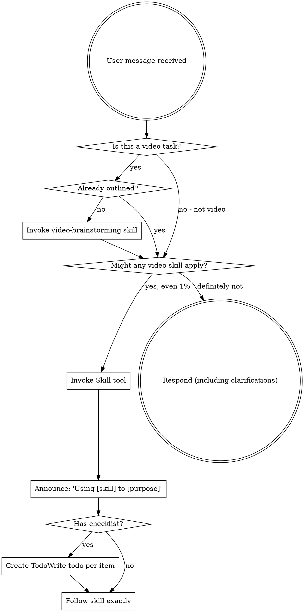

<EXTREMELY-IMPORTANT>
If you think there is even a 1% chance a video skill might apply to what you're doing, you ABSOLUTELY MUST invoke the skill.

IF A VIDEO SKILL APPLIES TO YOUR TASK, YOU DO NOT HAVE A CHOICE. YOU MUST USE IT.

This is not negotiable. This is not optional. You cannot rationalize your way out of it.
</EXTREMELY-IMPORTANT>

## How to Access Video Skills

**In Claude Code:** Use the `Skill` tool. When you invoke a skill, its content is loaded and presented to you—follow it directly. Never use the Read tool on skill files.

**In other environments:** Check your platform's documentation for how skills are loaded.

# Using Video Skills

## The Rule

**Invoke relevant video skills BEFORE any video creation or production work.** Even a 1% chance a video skill might apply means that you should invoke the skill to check. If an invoked skill turns out to be wrong for the situation, you don't need to use it.

## Video Skills Available

### Process Skills (Use First)

**superpowers-video:video-brainstorming**
- Use when: Starting any video project
- What: Explores purpose, audience, format, and key visual elements before production
- Output: Approved video outline with visual direction

### Production Skills (Use After Brainstorming)

**superpowers-video:video-script**
- Use when: You have an approved outline and need to create the script (scenes, visuals, narration)
- What: Creates detailed script with scene descriptions, visual elements, and narration
- Output: Complete video script with visual and audio specifications

**superpowers-video:video-subtitles**
- Use when: Script is complete and you need multi-track subtitles
- What: Designs and generates multi-track subtitle system (primary, secondary, emphasis tracks)
- Output: Subtitle files and specifications for 节映/剪映 (Jianying)

**superpowers-video:video-effects**
- Use when: Script and subtitles are ready, need transitions/effects/styling
- What: Specifies transitions, effects, and visual styles for each scene
- Output: Complete editing guide for 节映/剪映 (Jianying)

## Red Flags

These thoughts mean STOP—you're rationalizing:

| Thought | Reality |
|---------|---------|
| "This is just a quick video" | Quick videos benefit from structure. Check for skills. |
| "I don't need a plan for this" | Every video benefits from planning. Check first. |
| "I'll just edit it and see" | Editing without planning = rework. Skills prevent this. |
| "This doesn't need an outline" | Even simple videos need structure. Check first. |
| "I know what to film" | Knowing ≠ executing well. Skills ensure quality. |
| "The skill is overkill" | "Overkill" videos become simpler with structure. Use it. |
| "I've made this type before" | Each video is unique. Skills ensure consistency. |
| "I'll fix it in post" | Late fixes = expensive rework. Checkpoints prevent this. |
| "This feels productive" | Undisciplined video production wastes time. Skills prevent this. |
| "I don't need help with video" | Everyone benefits from structured process. Use skills. |

## Video Skill Priority

When multiple video skills could apply, use this order:

1. **Process skills first** (video-brainstorming) - determines WHAT you're creating and structure
2. **Script skills second** (video-script) - guides content creation with visual specs
3. **Subtitle skills third** (video-subtitles) - ensures accessibility and multi-language support
4. **Effects skills fourth** (video-effects) - polish with transitions and styling

"Make a tutorial video" → video-brainstorming first, then video-script, then video-subtitles, then video-effects.

"Add subtitles to this video" → video-subtitles directly if script exists.

"Create effects for this scene" → video-effects if script and subtitles are ready.

## Skill Types

**Rigid** (video-brainstorming): Follow exactly. The hard gate exists for a reason.

**Flexible** (video-effects): Adapt the style and effects to the video type and context.

The skill itself tells you which.

## What Counts as a Video Task

**Definitely video tasks (use skills):**
- Tutorial videos
- Product demos
- Marketing videos
- Educational content
- Social media videos (TikTok, Instagram, YouTube)
- Corporate videos
- Documentary-style content
- Screen recordings with narration
- Animated explainers
- Interview videos
- Vlogs and lifestyle content

**Borderline (check if skills apply):**
- Quick screen recordings
- Video messages
- GIF-style clips
- Video testimonials
- Live stream preparations

**Probably not video (use other skills):**
- Audio production only
- Image editing only
- Code implementation
- System debugging

## User Instructions

Instructions say WHAT, not HOW. "Make a video about X" or "Create a tutorial for Y" doesn't mean skip the video workflow.

The workflow exists to ensure:
- Clear purpose and audience before production
- Structured approach prevents wasted effort
- Checkpoints catch issues early
- Systematic review ensures quality
- Proper preparation for 节映/剪映 (Jianying) editing

## Tool Integration

**Primary Tool:** 节映/剪映 (Jianying/CapCut)

This workflow is designed to prepare content specifically for editing in 节映/剪映:
- Scripts formatted for 节映/剪映's teleprompter
- Subtitles in 节映/剪映-compatible formats
- Effects and transitions using 节映/剪映's built-in library
- Timeline structured for efficient editing

## Integration with Other Skills

Video skills complement other creative skills:

**When creating video content:**
1. Use video-brainstorming for concept and structure
2. Use video-script for detailed content creation
3. Use video-subtitles for accessibility
4. Use video-effects for final polish

**When video includes written elements:**
1. Video skills for the visual production
2. Writing skills for scripts, narration, captions

They work together, not in competition.

## The Bottom Line

**Video Production = Creative Development**

Both require:
- Planning before execution
- Structure before substance
- Checkpoints during production
- Systematic review before completion

If you use creative skills for other content, use video skills for video production. Same discipline, different domain.
