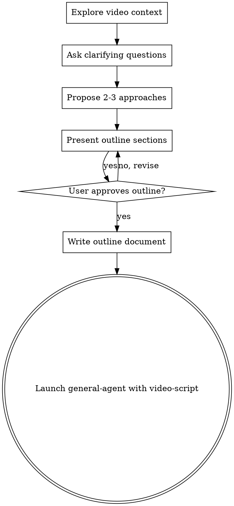

# Video Brainstorming

## Overview

Help turn video ideas into fully formed outlines and production plans through natural collaborative dialogue.

Start by understanding the video context, then ask questions one at a time to refine the concept. Once you understand what you're creating, present the outline and get user approval.

<HARD-GATE>
Do NOT start writing scripts, designing scenes, or creating any production elements until you have presented an outline and the user has approved it. This applies to EVERY video task regardless of perceived simplicity.
</HARD-GATE>

## Anti-Pattern: "This Is Too Simple To Need An Outline"

Every video project goes through this process. A quick screen recording, a short tutorial, a marketing clip — all of them. "Simple" videos are where unexamined assumptions cause the most wasted effort. The outline can be short (3-5 bullet points for truly simple videos), but you MUST present it and get approval.

## Checklist

You MUST create a task for each of these items and complete them in order:

1. **Explore video context** — understand purpose, platform, duration, constraints
2. **Ask clarifying questions** — one at a time, understand audience/tone/style/goals/success criteria
3. **Propose 2-3 approaches** — with trade-offs and your recommendation
4. **Present outline sections** — scaled to complexity, get user approval after each section
5. **Write outline document** — save to appropriate location
6. **Transition to script writing** — use general-agent subagent to load video-script skill for production

## Process Flow

**The terminal state is launching a general-agent subagent with video-script skill.** Do NOT start writing scripts or designing scenes directly. The ONLY action after brainstorming is delegating to a general-agent subagent that loads video-script.

## The Process

**Understanding the video task:**

- Check the current context first (existing footage, target platform, constraints)
- Ask questions one at a time to refine the concept
- Prefer multiple choice questions when possible, but open-ended is fine too
- Only one question per message - if a topic needs more exploration, break it into multiple questions
- Focus on understanding: purpose, audience, tone, format, duration, success criteria

**Key questions to explore:**

- **Purpose:** What are you trying to achieve? Teach, promote, entertain, demonstrate?
- **Audience:** Who will watch this? What's their background? What do they already know?
- **Platform:** TikTok, YouTube, Instagram, Bilibili, WeChat, internal, other?
- **Format:** Tutorial, demo, vlog, interview, documentary, animation, screen recording?
- **Duration:** Short (<1 min), medium (1-5 min), long (5-15 min), extended (15+ min)?
- **Style:** Professional, casual, humorous, inspirational, technical, artistic?
- **Resources:** Available footage, need to film, screen recording, animation, stock footage?
- **Success criteria:** What makes this video successful? Views, engagement, learning, conversion?

**Exploring approaches:**

- Propose 2-3 different approaches with trade-offs
- Present options conversationally with your recommendation and reasoning
- Lead with your recommended option and explain why

**Presenting the outline:**

- Once you understand what you're creating, present the outline
- Scale each section to its complexity: bullet points if straightforward, detailed structure if nuanced
- Ask after each section whether it looks right so far
- Cover: hook/intro, main scenes, key visual elements, conclusion, call-to-action
- Include visual direction and pacing notes
- Be ready to go back and clarify if something doesn't make sense

## Video-Specific Considerations

**Platform Requirements:**
- TikTok: 9:16 vertical, fast-paced, <3 min ideal
- YouTube: 16:9 horizontal, can be longer, SEO-friendly titles
- Instagram: 1:1 or 9:16, visual-first, shorter duration
- Bilibili: 16:9, longer form acceptable, community interaction
- WeChat: 16:9 or 9:16, depends on use case

**Visual Style:**
- Minimal/clean: Focus on content, simple backgrounds
- Dynamic: Lots of movement, transitions, effects
- Professional: Polished, consistent branding
- Casual: Handheld, authentic feel
- Animated: Motion graphics, illustrations

**Audio Considerations:**
- Background music choice
- Voice-over vs on-camera audio
- Sound effects emphasis
- Silence/pacing for impact

## After the Outline

**Documentation:**

- Write the validated outline to appropriate location (depends on project)
- For tutorials: Save as outline file
- For marketing: Save in project folder
- For social media: Save with campaign assets

**Next steps:**

- Launch a general-agent subagent with the video-script skill loaded
- The subagent will use the approved outline to create the detailed script
- Do NOT start writing scripts directly in this session
- Delegation to general-agent with video-script is the next step

## Key Principles

- **One question at a time** - Don't overwhelm with multiple questions
- **Multiple choice preferred** - Easier to answer than open-ended when possible
- **YAGNI ruthlessly** - Remove unnecessary scenes from all outlines
- **Explore alternatives** - Always propose 2-3 approaches before settling
- **Incremental validation** - Present outline, get approval before moving on
- **Be flexible** - Go back and clarify when something doesn't make sense
- **Think in scenes** - Video is visual, structure in visual beats
- **Consider the edit** - Plan for how this will be edited in 节映/剪映

## Example Workflow

**User:** "I need to make a tutorial video about using our product"

**You:** Let me understand this better first.

[Check if there's existing footage, target platform, constraints]

**Question 1:** What's the main goal of this video?

**Options:**
1. Help new users get started quickly (onboarding)
2. Teach advanced features to existing users
3. Show a specific workflow or use case
4. Something else?

**User:** "Option 1 - help new users get started"

**Question 2:** Where will this video be published?

**Options:**
1. YouTube (searchable, longer format)
2. TikTok/Shorts (quick tips, <1 min)
3. Website/Help center (professional, educational)
4. WeChat/Bilibili (Chinese audience)
5. Internal training (employees only)

**User:** "Option 3 - website and help center"

**Question 3:** What visual style should this have?

**Options:**
1. Screen recording with voice-over (simple, clear)
2. Face camera + screen recording (personal, engaging)
3. Animated explainer (polished, consistent)
4. Mixed media (screen, face, graphics)

**User:** "Option 4 - mixed media"

**Question 4:** How long should this be?

**Options:**
1. Quick start (<2 min, essentials only)
2. Standard tutorial (3-5 min, comprehensive)
3. Deep dive (5-10 min, detailed)
4. Multi-part series (10+ min each, extensive)

**User:** "Option 2 - 3-5 minutes"

[Continue exploring... tone, branding, resources, etc.]

**You:** Great, I understand now. Here's my recommended approach:

**Approach 1 (Recommended):** Problem-solution flow with mixed media
- Start with user pain point (hook)
- Show quick solution preview (tease)
- Step-by-step walkthrough with screen recording
- Face camera for intro/outro and key transitions
- Animated graphics for emphasis
- ~4 minutes total

**Approach 2:** Pure screen recording
- Simpler to produce, faster to create
- Less engaging but very clear
- ~3 minutes total

**Approach 3:** Story-based tutorial
- Follow a user through using the product
- More authentic but less controlled
- ~5 minutes total

**My recommendation:** Approach 1, because it balances engagement with clarity and works well for help center content.

**User:** "Let's go with approach 1"

**You:** Perfect. Here's the outline:

**Section 1: Hook & Problem** (0:00-0:30)
- Face camera intro: "Struggling with X? Here's the solution"
- Show common frustration point
- Quick preview of what they'll learn

Does this structure look right so far?

**User:** "Yes"

**You:**

**Section 2: Solution Overview** (0:30-1:00)
- Screen recording: Product dashboard/interface
- Highlight key features to be covered
- Set expectations: "In 4 minutes, you'll know how to..."

**Section 3: Step-by-Step Walkthrough** (1:00-3:00)
- Screen recording with cursor highlights
- Step 1: Getting started (30 sec)
- Step 2: Key feature A (45 sec)
- Step 3: Key feature B (45 sec)
- Face camera cutaways for tips and warnings

**Section 4: Pro Tips** (3:00-3:30)
- Animated graphics overlay
- 3 quick tips for advanced usage
- Common mistakes to avoid

**Section 5: Conclusion & CTA** (3:30-4:00)
- Face camera: Summary of what was covered
- "Now you know how to..."
- Call to action: Try it yourself / Watch next tutorial

**Visual Style Notes:**
- Clean, professional aesthetic
- Brand colors throughout
- Smooth transitions between scenes
- Upbeat but not distracting background music

**Audio Notes:**
- Professional voice-over for screen sections
- On-camera audio for face sections
- Subtle sound effects for emphasis
- Music fades for important moments

Total: ~4 minutes

Does this outline work for you?

**User:** "Looks good, let's proceed"

**You:** Excellent! I'm launching a general-agent subagent with the video-script skill to create the detailed script with scenes, visuals, and narration.

[Launch general-agent subagent with video-script skill loaded]
