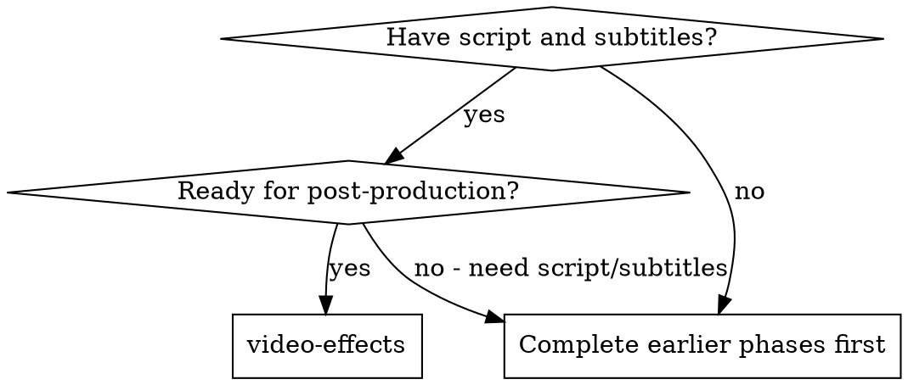

# Video Effects & Styling

## Overview

Create comprehensive effects, transitions, and visual styling specifications that transform a scripted video into a polished final product, leveraging 节映/剪映's (Jianying/CapCut) extensive effects library for professional results.

<PREREQUISITE>
Must have completed script and subtitle tracks before using this skill.
</PREREQUISITE>

**Core principle:** Strategic effects enhance storytelling without overwhelming content.

**Announce at start:** "I'm using the video-effects skill to create a comprehensive effects and styling guide for the video."

## When to Use



**Use when:**
- Script and subtitles are complete
- Ready to specify post-production elements
- Need transitions between scenes
- Want to add visual polish and engagement
- Preparing for 节映/剪映 editing

**Skip when:**
- Script or subtitles incomplete
- Video requires no effects (minimalist approach)
- Effects already specified

## The Process

### Step 1: Analyze Video Style and Tone

1. Review the completed script and subtitles
2. Understand the video's purpose and audience
3. Identify the visual style (professional, casual, dynamic, minimal)
4. Note pacing and energy requirements
5. Consider platform norms and audience expectations

### Step 2: Design Effects Strategy

**Effects Categories:**

**Category 1: Transitions**
- Scene-to-scene transitions
- Within-scene transitions
- Text and graphic animations
- Audio transitions

**Category 2: Visual Effects**
- Color grading and correction
- Overlay effects
- Picture-in-picture
- Split screens
- Speed effects (ramp, reverse, slow-mo)

**Category 3: Text & Graphics Animations**
- Title animations
- Text reveal effects
- Graphic element animations
- Lower thirds animations
- Call-out animations

**Category 4: Audio Effects**
- Audio transitions
- Music fades and ducking
- Sound effect timing
- Voice-over processing
- Ambient audio layering

**Category 5: Styling**
- Color palettes
- Visual style consistency
- Brand elements integration
- Typography styling

### Step 3: Create Transition Specifications

For each scene transition, specify:

```markdown
## Scene Transitions

### Scene 1 → Scene 2: Intro to Screen Recording
**Transition Type:** Quick Cut
**Duration:** 0 frames (instant)
**Reasoning:** Maintain energy, jump into content

**节映/剪映 Implementation:**
- Use "Cut" (no transition effect)
- Optional: Add subtle "Flash" (0.1s) for emphasis

### Scene 2 → Scene 3: Screen Recording Section A to B
**Transition Type:** Cross Dissolve
**Duration:** 0.5 seconds (12 frames at 24fps)
**Reasoning:** Smooth flow between related sections

**节映/剪映 Implementation:**
- Effect: "Dissolve" or "Cross Fade"
- Duration: 0.5s
- Alignment: Centered between clips

### Scene 3 → Scene 4: Screen Recording to Face Camera
**Transition Type:** Zoom Transition
**Duration:** 0.3 seconds
**Reasoning:** Re-engage with presenter, dynamic feel

**节映/剪映 Implementation:**
- Effect: "Zoom In" or "Push"
- Direction: Screen zooms into presenter
- Duration: 0.3s
- Optional: Add "Whoosh" sound effect

### Scene 4 → Scene 5: Face Camera to Graphics
**Transition Type:** Fade to Black then Fade to Graphics
**Duration:** 0.5s fade out + 0.5s fade in
**Reasoning:** Reset attention, prepare for concept explanation

**节映/剪映 Implementation:**
- Effect: "Fade" (black)
- Duration: 0.5s each
- Optional: Add brief black slug (0.2s) between fades

### Scene 5 → Scene 6: Graphics to Conclusion
**Transition Type:** Wipe or Slide
**Duration:** 0.4 seconds
**Reasoning:** Dynamic conclusion, forward momentum

**节映/剪映 Implementation:**
- Effect: "Slide" or "Wipe"
- Direction: Left to right (forward motion)
- Duration: 0.4s
- Optional: Add "Swoosh" sound effect
```

**Transition Guidelines by Video Type:**

**Professional/Educational:**
- Use: Dissolves, fades, simple cuts
- Avoid: Flashy transitions, excessive motion
- Pace: Smooth, unhurried
- Purpose: Maintain credibility and focus

**Dynamic/Marketing:**
- Use: Zooms, slides, wipes, quick cuts
- Embrace: Flash, glitch effects for emphasis
- Pace: Fast, energetic
- Purpose: Maintain engagement and energy

**Casual/Vlog:**
- Use: Simple cuts, occasional dips to black
- Style: Minimal, natural
- Pace: Varied, follows conversation
- Purpose: Authentic, relatable feel

### Step 4: Create Visual Effects Specifications

```markdown
## Visual Effects by Scene

### Scene 1: Face Camera Intro
**Color Grade:**
- Preset: "Bright & Clean" or "Natural"
- Adjustments: +5% brightness, +10% saturation
- Skin tones: Natural, slightly warm
- Overall: Clean, professional look

**节映/剪映 Implementation:**
- Filter: "Natural" or "Brighten"
- Intensity: 30-50%
- Adjust: Exposure +0.1, Saturation +0.1

**Effects:**
- None (keep clean and simple)
- Optional: Subtle vignette for focus

---

### Scene 2-4: Screen Recordings
**Color Grade:**
- Preset: "Crisp Screen" or "Boost Contrast"
- Adjustments: +10% contrast, +5% sharpness
- Text clarity: Enhance readability
- Overall: Clear, easy to read

**节映/剪映 Implementation:**
- Filter: "Enhance" or "Sharpen"
- Intensity: 20-30%
- Adjust: Contrast +0.1, Sharpness +0.15

**Effects:**
1. **Cursor Highlight:**
   - Effect: "Cursor Circle" or "Cursor Glow"
   - Color: Yellow (#FFFF00) or brand color
   - Size: 80-100px diameter
   - Opacity: 80%
   - Follow cursor automatically

2. **Screen Zoom:**
   - Effect: "Zoom to Cursor" or "Crop & Zoom"
   - Trigger: On key actions
   - Zoom level: 1.2x - 1.5x
   - Duration: 2-3 seconds per zoom
   - Smooth ease-in/out

3. **Spotlight:**
   - Effect: "Vignette" or "Spotlight"
   - Purpose: Darken non-active areas
   - Opacity: 40-50%
   - Focus on: Relevant UI element

4. **Text Overlays:**
   - Effect: "Text Pop-in" or "Typewriter"
   - Duration: 0.3s animation
   - Timing: Sync with narration
   - Style: Match brand guidelines

---

### Scene 5: Animated Graphics
**Color Grade:**
- Preset: None (use graphics as-is)
- Ensure: Colors match video palette
- Check: Consistency across all graphics

**节映/剪映 Implementation:**
- Import graphics as overlays
- Use "Chroma Key" if transparent background
- Apply "Glow" effect for emphasis
- Use "Animation In" for entrance

**Effects:**
1. **Entrance Animations:**
   - Effect: "Fade In + Scale Up" or "Slide In"
   - Duration: 0.3-0.5s
   - Easing: Smooth (ease-out)
   - Stagger: Multiple elements animate sequentially

2. **Emphasis Effects:**
   - Effect: "Pulse" or "Bounce" on key elements
   - Trigger: When mentioned in narration
   - Duration: 0.5s per pulse
   - Repeat: Once or twice max

3. **Exit Animations:**
   - Effect: "Fade Out + Scale Down" or "Slide Out"
   - Duration: 0.3s
   - Timing: Before scene transition

---

### Scene 6: Face Camera Conclusion
**Color Grade:**
- Match: Scene 1 intro (consistency)
- Preset: "Bright & Clean"
- Adjustments: Same as intro

**节映/剪映 Implementation:**
- Same filter and settings as Scene 1
- Ensure visual bookend consistency

**Effects:**
- Optional: Subtle light leak or lens flare
- Purpose: Warm, positive conclusion tone
```

### Step 5: Create Text and Graphic Animation Specifications

```markdown
## Text & Graphic Animations

### Title Card (if applicable)
**Animation:**
- Effect: "Cinematic Title Reveal"
- Duration: 1.5s total
- Sequence:
  1. Background fades in (0.5s)
  2. Title scales up with fade (0.5s)
  3. Subtitle fades in below (0.3s)
  4. Hold for 2-3s
  5. All elements fade out (0.5s)

**节映/剪映 Implementation:**
- Use "Text" > "Templates" > "Cinematic" category
- Customize colors to match brand
- Adjust timing to sync with music

---

### Lower Thirds (Name/Title)
**Animation:**
- Effect: "Slide In from Left"
- Duration: 0.3s in, 0.2s out
- Position: Bottom left, safe zone
- Style: Two-line (name + title)
- Hold: While person speaks

**节映/剪映 Implementation:**
- Use "Text" > "Lower Thirds" templates
- Customize: Font, colors, duration
- Keyframe: Position and opacity

---

### Text Overlays (Bullet Points, Call-outs)
**Animation:**
- Effect: "Typewriter" or "Pop-in Sequential"
- Duration: 0.2s per bullet
- Sequence: Bullets appear one by one
- Timing: Sync with narration
- Exit: Fade out all at once (0.3s)

**节映/剪映 Implementation:**
- Use "Text" > "Animations" > "Typewriter"
- Or manually keyframe opacity/scale
- Sync to audio waveform for precision

---

### Emphasis Text (Pro Tips, Warnings)
**Animation:**
- Effect: "Scale Pop" + "Glow"
- Duration: 0.2s in, hold 2-4s, 0.2s out
- Style: Bold, highlight color
- Position: Near relevant action
- Accompanied by: Sound effect ("ding" or "pop")

**节映/剪映 Implementation:**
- Use "Text" > "Animations" > "Pop"
- Add "Glow" effect in "Effects" panel
- Keyframe: Scale 0.8 → 1.0 → 0.8
- Add sound effect on same timeline

---

### End Screen / CTA
**Animation:**
- Effect: "Fade In + Slide Up"
- Duration: 0.5s
- Timing: 2s before video end
- Hold: Until video end
- Content: Subscribe, like, next video links

**节映/剪映 Implementation:**
- Use "Text" > "End Screen" templates
- Add button shapes for CTAs
- Include: Social icons, channel art
```

### Step 6: Create Audio Effects Specifications

```markdown
## Audio Effects & Mixing

### Background Music
**Track Selection:**
- Style: Match video tone (upbeat, calm, energetic)
- Tempo: Match video pace
- Instrumentation: Support content, don't distract

**Mixing:**
- Overall volume: -15dB to -20dB (behind voice)
- Variations:
  - Quieter during narration sections (-18dB)
  - Louder during montages/B-roll (-12dB)
  - Fade out during important dialogue

**节映/剪映 Implementation:**
- Import music track to audio timeline
- Use "Volume" automation for mixing
- Keyframe volume changes at scene boundaries
- Apply "Fade In" (0.5s) at start
- Apply "Fade Out" (1-2s) at end

**Transitions:**
- Scene changes: Crossfade music (0.5s)
- Montage sections: Energy increase (filter + volume)
- Conclusion: Gradual fade (2-3s)

---

### Voice-Over / Narration
**Processing:**
- Volume: 0dB (reference level)
- Compression: Light compression for consistency
- EQ: Boost clarity (2-4kHz), reduce mud (200-300Hz)

**节映/剪映 Implementation:**
- Use "Audio" > "Enhance" for noise reduction
- Apply "Compressor" lightly (ratio 2:1)
- Use "EQ" preset "Voice Enhancement"

**Timing:**
- Sync precisely to visuals
- Cut on breaths for natural edits
- Crossfade between clips (0.1s)
- Remove long pauses (but keep natural rhythm)

---

### Sound Effects
**Categories:**

1. **UI Sounds:**
   - Clicks, button presses, notifications
   - Timing: Sync to on-screen action
   - Volume: -10dB (subtle but audible)

2. **Transitions:**
   - Whoosh, swoosh, swoop
   - Timing: Start 0.1s before transition
   - Volume: -8dB

3. **Emphasis:**
   - Ding, pop, chime for important points
   - Timing: Sync with text overlays
   - Volume: -6dB (cut through slightly)

4. **Ambient:**
   - Room tone, environment sounds
   - Purpose: Maintain continuity between cuts
   - Volume: -25dB (very subtle)

**节映/剪映 Implementation:**
- Import SFX to audio timeline
- Sync precisely to visual events
- Use "Volume" automation for level changes
- Pan appropriately (stereo field)
- Apply "Fade In/Out" (0.1s) to prevent clicks

---

### Audio Ducking
**Purpose:** Automatically lower music when voice speaks

**节映/剪映 Implementation:**
- Use "Audio Ducking" feature if available
- Settings:
  - Duck amount: -6dB to -10dB
  - Attack: 0.1s (fast)
  - Release: 0.5s (smooth)
  - Threshold: Voice presence triggers duck

**Manual Alternative:**
- Keyframe music volume down when voice speaks
- Keyframe music volume up during gaps
- Smooth transitions (0.3s duration)
```

### Step 7: Create Color Grading Specifications

```markdown
## Color Grading & Visual Style

### Overall Look
**Style:** [Match to video type]

**Professional/Educational:**
- Clean, neutral color balance
- Slightly warm skin tones
- Good contrast for readability
- Minimal color grading

**节映/剪映 Implementation:**
- Filter: "Natural" or "None"
- Adjustments: Exposure 0, Contrast +0.1, Saturation 0

---

**Dynamic/Marketing:**
- Vibrant, saturated colors
- Higher contrast
- Bold, energetic feel
- Color grading for emotion

**节映/剪映 Implementation:**
- Filter: "Vibrant" or "Pop"
- Adjustments: Contrast +0.2, Saturation +0.2, Warmth +0.1

---

**Casual/Vlog:**
- Natural, authentic look
- Slightly warm or cool tone (choice)
- Lower contrast, softer feel
- Minimal grading

**节映/剪映 Implementation:**
- Filter: "Soft" or "Warm"
- Adjustments: Contrast -0.1, Saturation -0.1, Warmth +0.2

---

### Scene-Specific Grading
**Face Camera Scenes:**
- Focus: Flattering skin tones
- Avoid: Over-saturation
- Preset: "Portrait" or "Natural"

**Screen Recordings:**
- Focus: Text readability
- Enhance: Contrast and sharpness
- Preset: "Enhance" or "Crisp"

**Graphics/Animation:**
- Focus: Match video palette
- Ensure: Brand color accuracy
- Preset: None (use graphics as-designed)

**B-Roll:**
- Match: Primary footage style
- Apply: Same filter as main scenes
- Ensure: Consistency across all B-roll

---

### Shot Matching
**Purpose:** Ensure consistency across different shots

**节映/剪映 Implementation:**
1. Apply base filter to all clips
2. Manually match exposure/contrast
3. Use "Color Match" tool if available
4. Check skin tone consistency
5. Verify across entire timeline

**Reference Frame:**
- Choose: Best-exposed shot as reference
- Match: All other shots to reference
- Focus: Skin tones, overall brightness
```

### Step 8: Export and Delivery Specifications

```markdown
## Export Settings for Final Video

### Platform-Specific Settings

**YouTube:**
- Resolution: 1920x1080 (16:9)
- Frame Rate: 24fps or 30fps
- Codec: H.264
- Bitrate: 8-12 Mbps (1080p)
- Audio: AAC, 48kHz, 320kbps, Stereo
- Container: MP4

**TikTok / Instagram Reels:**
- Resolution: 1080x1920 (9:16)
- Frame Rate: 30fps
- Codec: H.264
- Bitrate: 6-8 Mbps
- Audio: AAC, 48kHz, 128kbps, Stereo
- Container: MP4

**Bilibili:**
- Resolution: 1920x1080 (16:9)
- Frame Rate: 24fps or 30fps
- Codec: H.264
- Bitrate: 10-15 Mbps (1080p)
- Audio: AAC, 48kHz, 320kbps, Stereo
- Container: MP4

**WeChat:**
- Resolution: 1920x1080 or 1080x1920
- Frame Rate: 30fps
- Codec: H.264
- Bitrate: 5-8 Mbps
- Audio: AAC, 44.1kHz, 128kbps, Stereo
- Container: MP4

### Quality Control Checklist
- [ ] No audio clipping or distortion
- [ ] Consistent volume throughout
- [ ] No visual glitches or artifacts
- [ ] Smooth playback at normal speed
- [ ] Text is readable on all devices
- [ ] Colors look accurate
- [ ] Transitions are smooth
- [ ] Audio/video synced perfectly
- [ ] Export meets platform specs
- [ ] File size is acceptable
```

### Step 9: 节映/剪映 Project Setup Guide

```markdown
# 节映/剪映 Project Setup & Editing Guide

## Project Creation
1. Open 节映/剪映
2. Create new project
3. Select canvas ratio:
   - 16:9 for YouTube, Bilibili
   - 9:16 for TikTok, Instagram
4. Set frame rate: 24fps or 30fps

## Timeline Organization
```
Video Track 1: Face camera scenes
Video Track 2: Screen recordings
Video Track 3: B-roll footage
Video Track 4: Graphics/overlays
Video Track 5: Text elements

Audio Track 1: Voice-over/narration
Audio Track 2: Background music
Audio Track 3: Sound effects
```

## Editing Workflow
1. **Import all assets** (footage, graphics, audio)
2. **Rough cut:** Arrange scenes in order
3. **Fine cut:** Trim to precise timing
4. **Add transitions** between scenes
5. **Apply color grading** to all clips
6. **Add text and graphics** with animations
7. **Add subtitles** (import SRT files)
8. **Mix audio** (music, VO, SFX levels)
9. **Apply effects** (cursor highlight, zooms, etc.)
10. **Preview at full speed** for quality check
11. **Export** using platform-specific settings

## Effects Reference (节映/剪映 Library)

### Transitions
- **Cut:** No effect, instant switch
- **Dissolve:** Smooth crossfade
- **Fade:** Fade to/from black
- **Zoom:** Zoom in/out transition
- **Slide:** Slide in from direction
- **Wipe:** Wipe across screen
- **Glitch:** Digital glitch effect
- **Flash:** Bright flash transition

### Video Effects
- **Cursor Highlight:** Circle around cursor
- **Zoom:** Crop and scale to zoom
- **Spotlight:** Vignette/spotlight effect
- **Speed Ramp:** Variable speed changes
- **Picture-in-Picture:** Overlay video
- **Split Screen:** Side-by-side videos
- **Glow:** Add glow to elements
- **Blur:** Blur parts of frame

### Text Effects
- **Typewriter:** Text appears letter-by-letter
- **Pop:** Text pops in with scale
- **Slide In:** Text slides in from direction
- **Fade In:** Text fades in
- **Glitch:** Text glitch effect
- **Neon:** Neon glow text
- **3D:** 3D perspective text

### Audio Effects
- **Fade In/Out:** Smooth audio level change
- **Ducking:** Auto-lower music when voice speaks
- **Compressor:** Even out audio levels
- **EQ:** Shape audio frequencies
- **Reverb:** Add room reverb
- **Noise Reduction:** Remove background noise

## Keyboard Shortcuts (节映/剪映)
- **Split:** Cmd/Ctrl + B
- **Delete:** Delete/Backspace
- **Undo:** Cmd/Ctrl + Z
- **Redo:** Cmd/Ctrl + Shift + Z
- **Play/Pause:** Spacebar
- **Zoom In/Out:** Cmd/Ctrl + +/-
- **Snap to Grid:** N
```

## Best Practices

**For transitions:**
- Match transition style to video tone
- Keep duration short (0.3-0.5s typical)
- Don't overuse flashy transitions
- Use cuts for professional content
- Use zooms/slides for dynamic content

**For effects:**
- Less is more - don't overdo effects
- Every effect should serve a purpose
- Maintain consistency across video
- Test effects at full playback speed
- Consider performance (rendering time)

**For audio:**
- Voice is king - prioritize clarity
- Music supports, doesn't compete
- Use sound effects sparingly
- Mix at appropriate levels
- Test on multiple devices

**For color grading:**
- Match shots for consistency
- Focus on skin tones for face camera
- Enhance readability for screen recordings
- Don't over-grade (unnatural looks)
- Consider brand colors

## Common Mistakes

**Avoid:**
- Too many flashy transitions
- Effects that distract from content
- Inconsistent styling across scenes
- Audio that's too loud or quiet
- Over-graded color (unnatural look)
- Text that's hard to read
- Effects that don't match video tone
- Forgetting to maintain consistency

**Instead:**
- Use transitions strategically
- Let effects serve the content
- Maintain consistent style
- Mix audio appropriately
- Grade for natural look
- Ensure text readability
- Match effects to video tone
- Check consistency throughout

## Output Format

Produce these outputs:

### 1. Effects Specifications Document
Detailed breakdown of all effects, transitions, and styling:

```markdown
# Effects & Styling Specifications for [Project Name]

## Transitions
[Detailed transition specifications]

## Visual Effects
[Scene-by-scene effects breakdown]

## Text & Graphic Animations
[Animation specifications for all text/graphics]

## Audio Effects & Mixing
[Audio processing and mixing guide]

## Color Grading
[Color grading specifications by scene type]

## Export Settings
[Platform-specific export settings]
```

### 2. 节映/剪映 Implementation Guide
Step-by-step instructions for applying effects in 节映/剪映:

```markdown
# 节映/剪映 Implementation Guide

## Scene-by-Scene Effects
[Detailed instructions for each scene]

## Effects Library Reference
[Which 节映/剪映 effects to use]

## Timeline Setup
[How to organize tracks]

## Quality Control
[Checklist before export]
```

### 3. Effects Checklist
Quick reference for effects application:

```markdown
## Effects Application Checklist

### Scene 1: [Title]
- [ ] Color grade applied
- [ ] Transitions set (in/out)
- [ ] Text effects added
- [ ] Audio mixed
- [ ] Effects applied

### Scene 2: [Title]
[... repeat for all scenes ...]

### Overall
- [ ] Consistent style throughout
- [ ] Audio levels balanced
- [ ] All transitions smooth
- [ ] Text is readable
- [ ] Colors are consistent
- [ ] Export settings confirmed
```

## Integration

**Use after:**
- **superpowers-video:video-script** - Script needed for scene structure
- **superpowers-video:video-subtitles** - Subtitles needed for text effects

**Works with:**
- Any video type that needs post-production polish
- Content edited in 节映/剪映
- Professional and casual video styles
- Multi-platform video distribution

## Remember

- Effects enhance, don't replace content
- Consistency is key throughout
- Less is often more
- Match effects to video tone
- Test at full playback speed
- Consider platform constraints
- Plan for 节映/剪映's capabilities
- Quality check before export

## Checklist

- [ ] Analyzed video style and tone
- [ ] Created transition specifications
- [ ] Created visual effects specifications
- [ ] Created text/graphic animation specifications
- [ ] Created audio effects specifications
- [ ] Created color grading specifications
- [ ] Created export specifications
- [ ] Created 节映/剪映 implementation guide
- [ ] Created effects checklist
- [ ] Verified all effects serve purpose
- [ ] Confirmed consistency across video
- [ ] Tested effects compatibility with platform
- [ ] Validated export settings for target platform
