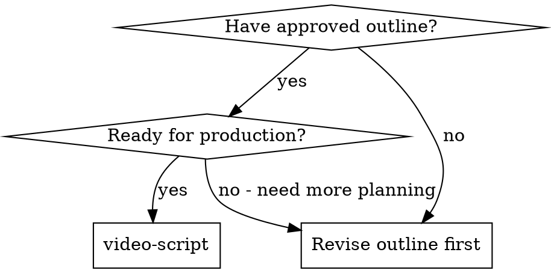

# Video Script Writing

## Overview

Transform approved video outlines into detailed, production-ready scripts with scene-by-scene breakdowns, visual descriptions, narration, and technical specifications optimized for 节映/剪映 (Jianying/CapCut) editing.

<PREREQUISITE>
Must have an approved outline from video-brainstorming before using this skill.
</PREREQUISITE>

**Core principle:** Detailed scripts prevent production chaos and enable efficient editing.

**CRITICAL: Progressive Generation Required**
This skill **MUST** use part-by-part generation. Do NOT generate the entire script at once. Follow the progressive workflow below.

**Announce at start:** "I'm using the video-script skill to create a detailed production script from the approved outline. I'll generate this script part-by-part and automatically write each section to the output file as it's created."

## When to Use



**Use when:**
- You have an approved video outline
- Ready to create scene-by-scene breakdown
- Need detailed visual and audio specifications
- Preparing for 节映/剪映 editing workflow

**Skip when:**
- No approved outline exists (use video-brainstorming first)
- Only need rough concept (use brainstorming)
- Outline needs revision (go back to brainstorming)

## The Process

**CRITICAL: Progressive Generation with Auto-Save**

This skill uses a **progressive, part-by-part generation** approach. Each part is automatically written to the file as it's generated.

**Why?**
- Prevents overwhelming output
- Maintains context and focus
- Reduces errors and revisions
- Auto-saves each part immediately
- Creates production-ready document incrementally

### Step 0: Present the Generation Plan

**Before generating any content, first present a structured plan:**

```markdown
## 📋 Video Script Generation Plan

Based on the approved outline, I will generate the script in the following parts:

### Part 1: Foundation
- Script metadata and structure
- Scene overview with timing
- Total scene count: [N]

### Part 2-N: Individual Scenes
- Scene 1: [Scene name] (Duration: X:XX)
- Scene 2: [Scene name] (Duration: X:XX)
- ...
- Scene N: [Scene name] (Duration: X:XX)

### Final Part: Production Resources
- Visual assets list
- Audio assets list
- Export specifications
- 节映/剪映 editing notes

**Total estimated duration:** [X:XX]

**Output file:** [project-name]-script.md

---

Starting progressive generation... Each part will be automatically written to the file.
```

### Step 1: Load and Review the Outline

1. Read the approved outline document
2. Understand the video structure and flow
3. Note visual style, tone, and platform requirements
4. Identify key scenes and transitions
5. Confirm resources available (footage, graphics, etc.)

### Step 2: Generate the Foundation (Part 1)

**First, create the output file and write the script structure:**

1. Create/open file: `[project-name]-script.md`
2. Write the foundation section
3. Save the file
4. Proceed to Scene 1

**File content for Part 1:**

```markdown
# Video Script: [Title]

## Metadata
- **Title:** [Video title]
- **Duration:** [Estimated duration]
- **Platform:** [Target platform]
- **Format:** [Aspect ratio, specs]
- **Style:** [Visual style]
- **Created:** [Date]

## Scene Overview

| Scene | Title | Duration | Type | Status |
|-------|-------|----------|------|--------|
| 1 | [Scene 1 name] | 0:00-0:30 | Face camera | ⏳ Pending |
| 2 | [Scene 2 name] | 0:30-1:15 | Screen recording | ⏳ Pending |
| ... | ... | ... | ... | ... |
| N | [Scene N name] | X:XX-X:XX | [Type] | ⏳ Pending |

---
```

**After writing Part 1:**
- Save the file
- Update internal progress tracker
- Immediately proceed to generate Scene 1
- No user confirmation needed

### Step 3: Generate Scenes One by One (Parts 2-N)

**For each scene:**
1. Generate the scene's complete details
2. Append to the output file
3. Update Scene Overview table (mark as ✅ Completed)
4. Save the file
5. Proceed to next scene immediately

**Scene content to append:**

```markdown
## Scene N: [Scene Title]

**Duration:** [X:XX - X:XX]
**Type:** [Face camera / Screen recording / Animation / Mixed]

**Visual Description:**
[Detailed description of what viewers see]

**Camera/Shot:**
- Shot type: [Wide / Medium / Close-up / Extreme close-up]
- Angle: [Eye level / High / Low / Dutch angle]
- Movement: [Static / Pan / Tilt / Zoom / Tracking]
- Framing: [Center / Rule of thirds / Symmetrical]

**Visual Elements:**
- Background: [Description]
- Props/objects: [List and positioning]
- Text/graphics: [Overlays, lower thirds, titles]
- Color scheme: [Dominant colors, mood]

**Action/Movement:**
[What happens in the scene, sequence of actions]

**Narration/Voice-over:**
[Exact spoken words, with timing notes]

**On-Camera Audio:**
[Spoken by talent on camera]

**Audio Elements:**
- Background music: [Track name, mood, volume level]
- Sound effects: [Specific SFX, timing]
- Ambient audio: [Room tone, environment]

**Transitions:**
- In: [How this scene begins]
- Out: [How this scene ends]
- Next: [Scene N+1 reference]

**Technical Notes:**
[Recording specs, graphics specs, special instructions]

**节映/剪映 Notes:**
[Specific editing instructions for this scene]

---
```

**Important:**
- Generate **one scene at a time**
- **Automatically append to file** after each scene
- Update the Scene Overview table (mark scenes as ✅ Completed)
- **Continue immediately to next scene** (no user confirmation needed)
- Maintain context from previous scenes
- Track progress internally

**Internal Progress Tracking:**
```
Scene 1: Generated → Written → Continue to Scene 2
Scene 2: Generated → Written → Continue to Scene 3
...
Scene N: Generated → Written → Continue to Production Resources
```

### Step 4: Scene Types and Templates

#### Template 1: Face Camera Intro/Outro

```markdown
## Scene N: Introduction Hook

**Duration:** 0:00 - 0:30
**Type:** Face camera

**Visual Description:**
Talent speaks directly to camera in welcoming posture. Background is clean, branded space with subtle product placement. Lighting is professional, three-point setup.

**Camera/Shot:**
- Shot type: Medium shot (chest up)
- Angle: Eye level, direct engagement
- Movement: Slight zoom in for emphasis at key moments
- Framing: Rule of thirds, talent slightly left of center

**Visual Elements:**
- Background: Blurred office/workspace, brand colors
- Lower third: [Name/Title] appears at 0:10
- Overlay: Key points appear as text bullets during speech

**Action/Movement:**
- Talent enters frame or is already present
- Makes eye contact with camera
- Uses hand gestures for emphasis
- Exits frame or freeze on final expression

**Narration/Voice-over:** (On-camera)
"Hey everyone! Are you struggling with [problem]? In this video, I'll show you [solution] in just 4 minutes. Let's dive in!"

**Audio Elements:**
- Background music: Upbeat, modern, fades at 0:15
- Sound effect: Subtle "whoosh" on text overlays

**Transitions:**
- In: Fade in from black
- Out: Quick cut to Scene 2 (screen recording)

**Technical Notes:**
- Record in 4K, 24fps or 30fps
- Use external mic for quality audio
- Leave 2-second buffer at start/end

**节映/剪映 Notes:**
- Add auto-captions in post
- Use "Smooth Zoom" effect on key phrases
- Apply "Bright & Clean" color preset
```

#### Template 2: Screen Recording

```markdown
## Scene N: Feature Demonstration

**Duration:** 1:00 - 1:45
**Type:** Screen recording with voice-over

**Visual Description:**
Clean screen recording showing product interface. Cursor is highlighted with yellow circle. Key areas are spotlighted. Text overlays label important elements.

**Camera/Shot:**
- Full screen capture
- Cursor: Highlighted with colored ring
- Zoom: Highlighted areas scale up slightly

**Visual Elements:**
- Screen: Product interface, clean layout
- Cursor highlight: Yellow circle, 80px diameter
- Spotlight: Darken non-active areas, highlight focus
- Text overlays: Labels appear to name UI elements
- Progress indicator: "Step 2 of 5" in corner

**Action/Movement:**
- Cursor moves to button A (0:05)
- Click and pause (0:08)
- Result appears (0:10)
- Cursor moves to menu B (0:15)
- Demonstrate feature (0:20-0:40)

**Narration/Voice-over:**
"Now, click on the [button name] here in the top right. This opens the [feature] panel. You can see [what happens]. Let's adjust these settings..."

**Audio Elements:**
- Background music: Subtle, continues from previous scene
- Click sounds: Subtle UI sound effects on clicks
- Success sound: Positive tone when feature works

**Transitions:**
- In: Quick cut from previous scene
- Out: Dissolve to next scene or face camera

**Technical Notes:**
- Record at 1080p or higher
- Use system audio for interface sounds
- Smooth cursor movement, no jerky motions
- Pause on important UI elements

**节映/剪映 Notes:**
- Use "Cursor Highlight" effect
- Apply "Screen Zoom" on focus areas
- Add "Auto Captions" from voice-over
- Sync text overlays to narration timing
```

#### Template 3: Animated Graphics

```markdown
## Scene N: Concept Explanation

**Duration:** 3:00 - 3:30
**Type:** Animated graphics / Motion design

**Visual Description:**
Animated illustration explaining [concept]. Clean, minimalist style with smooth motion. Icons and text animate in sequence. Color scheme matches brand.

**Camera/Shot:**
- Animated canvas (motion graphics)
- Style: Flat design, vector-style animation
- Motion: Smooth easing, organic movement

**Visual Elements:**
- Background: Solid brand color or subtle gradient
- Icons: [Icon A], [Icon B], [Icon C] animate in
- Text: Key points appear one by one
- Arrows/lines: Connect related concepts
- Emphasis: Pulse effect on important elements

**Action/Movement:**
- Scene opens with title graphic (0:00-0:03)
- Icon A slides in from left (0:05)
- Icon B fades in from center (0:08)
- Connection line draws between them (0:10)
- Text labels appear (0:12-0:15)
- Emphasis pulse on key concept (0:20)
- All elements settle into final layout (0:25)

**Narration/Voice-over:**
"Here's the key concept: [explanation]. Notice how [A] connects to [B], creating [result]. This means [insight]."

**Audio Elements:**
- Background music: Continues, slight energy increase
- Sound effects: Subtle "pop" on icons appearing
- Whoosh: On connection lines drawing

**Transitions:**
- In: Fade from previous scene
- Out: Elements animate out, scene fades

**Technical Notes:**
- Export animation as MP4 with alpha channel if possible
- Or export as solid background video
- 1920x1080 or 1080x1920 depending on platform
- Match frame rate to project (24/30fps)

**节映/剪映 Notes:**
- Import as overlay/video layer
- Use "Chroma Key" if alpha channel available
- Apply "Glow" effect on emphasis elements
- Sync animation to voice-over timing
```

#### Template 4: Mixed Media

```markdown
## Scene N: Real-World Example

**Duration:** 2:30 - 3:00
**Type:** Mixed media (B-roll + voice-over + text)

**Visual Description:**
Montage of real-world usage shots. Cut between B-roll footage, screen recording, and text overlays. Fast-paced, engaging editing.

**Camera/Shot:**
- Shot A: B-roll, medium shot of person using product
- Shot B: Close-up of hands/device
- Shot C: Screen recording of result
- Shot D: Text on colored background

**Visual Elements:**
- Shot A: Person at desk, natural lighting
- Shot B: Hands interacting with device
- Shot C: Screen showing successful outcome
- Shot D: Bold text: "Result: 3x faster"
- Transitions: Quick cuts between shots

**Action/Movement:**
- Person using product (0:00-0:08)
- Cut to close-up of hands (0:08-0:12)
- Cut to screen result (0:12-0:18)
- Cut to text overlay (0:18-0:23)
- Cut to next scene

**Narration/Voice-over:**
"Real users are seeing amazing results. Just look at [person]'s workflow - they completed [task] in half the time. Here's the result: [outcome]."

**Audio Elements:**
- Background music: Energy increases slightly
- Sound effects: Quick "whoosh" on cuts
- Ambient: Room tone from B-roll footage

**Transitions:**
- In: Quick cut from previous
- Out: Quick cut or dissolve to next
- Between shots: Quick cuts, 2-3 seconds each

**Technical Notes:**
- Match color grading across all shots
- Ensure consistent audio levels
- Use fast cuts for energy

**节映/剪映 Notes:**
- Use "Auto Cut" for fast cuts
- Apply "Color Match" across clips
- Add "Speed Ramp" on B-roll for emphasis
- Use "Text-to-Speech" timing for overlays
```

---

### Step 5: Structure the Script Document

Create a comprehensive script with these sections:

```markdown
# Video Script: [Title]

## Metadata
- **Title:** [Video title]
- **Duration:** [Estimated duration]
- **Platform:** [Target platform]
- **Format:** [Aspect ratio, specs]
- **Style:** [Visual style]
- **Created:** [Date]

## Scene Breakdown
[Numbered scenes with detailed breakdowns]

## Visual Assets List
[All visual elements needed]

## Audio Assets List
[All audio elements needed]

## Export Specifications
[Format, resolution, frame rate for 节映/剪映]
```

### Step 5: Generate Production Resources (Final Part)

**After all scenes are complete:**
1. Generate production assets section
2. Append to the output file
3. Save and close the file
4. Report completion

**Final content to append:**

```markdown


## Export Specifications for 节映/剪映

### Project Settings
- **Resolution:** 1920x1080 (16:9) or 1080x1920 (9:16)
- **Frame Rate:** 24fps (cinematic) or 30fps (standard)
- **Codec:** H.264
- **Bitrate:** 8-12 Mbps (1080p)

### Audio Settings
- **Sample Rate:** 48kHz
- **Bit Depth:** 16-bit or 24-bit
- **Channels:** Stereo
- **Format:** WAV or AAC

### Subtitles (for later phase)
- **Format:** SRT or 节映/剪映 native format
- **Language:** Primary + Secondary if needed
- **Style:** Match video style (bold, clean, etc.)

### Color Grading
- **Color Space:** sRGB
- **LUT:** [Specific LUT if used]
- **Style:** Consistent across all footage

### File Organization
```
project-name/
├── footage/
│   ├── face-camera/
│   ├── screen-recording/
│   └── b-roll/
├── graphics/
│   ├── overlays/
│   ├── lower-thirds/
│   └── backgrounds/
├── audio/
│   ├── voice-over/
│   ├── music/
│   └── sound-effects/
├── script/
│   └── video-script.md
└── exports/
    ├── draft-v1.mp4
    └── final.mp4
```

## 节映/剪映 Project Setup Notes

### Timeline Organization
- Track 1: Video footage
- Track 2: Screen recordings
- Track 3: Text/graphics overlays
- Track 4: Voice-over audio
- Track 5: Background music
- Track 6: Sound effects

### Editing Workflow
1. Import all footage to appropriate tracks
2. Sync voice-over to visuals
3. Add text overlays at timed markers
4. Apply transitions between scenes
5. Color grade all clips
6. Mix audio levels
7. Add auto-captions
8. Export draft for review

---

**✅ Script generation complete!**

All [N] scenes and production resources have been generated and written to [project-name]-script.md. The script is ready for production.
```

**After writing final part:**
1. Close and save the main script file
2. Report completion with file location
3. Optionally create separate supporting documents:
   - Asset checklist: `[project-name]-assets.md`
   - Quick reference: `[project-name]-quickref.md`
   - 节映/剪映 notes: `[project-name]-jianying-notes.md`

**Completion Report:**
```markdown
## ✅ Script Generation Complete

**File:** [project-name]-script.md
**Total Scenes:** [N]
**Total Duration:** [X:XX]
**Generated:** [Date]

All scenes and production resources have been automatically written to the script file.
The script is ready for production use.
```

---

## Best Practices

**For scripts:**
- Be specific about timing (down to the second)
- Include exact spoken words (no "say something about X")
- Detail visual elements thoroughly
- Specify all audio elements
- Include technical notes for each scene

**For visual descriptions:**
- Paint a clear picture of what's on screen
- Specify camera angles and movements
- Detail lighting and mood
- Include color and composition notes
- Describe all text and graphics

**For narration:**
- Write for speaking, not reading
- Use conversational, natural language
- Mark emphasis and pauses
- Include pronunciation guides for difficult terms
- Time the narration to visual action

**For 节映/剪映 optimization:**
- Use effects available in 节映/剪映 library
- Specify text styles and animations
- Note transition types
- Include color grading directions
- Plan for efficient editing workflow

## Common Mistakes

**Avoid:**
- ❌ **Generating the entire script at once** (CRITICAL ERROR)
- ❌ Not presenting the generation plan first
- ❌ Not writing parts to file immediately
- ❌ Waiting for user confirmation between parts
- ❌ Vague visual descriptions ("show the product")
- ❌ Missing audio specifications
- ❌ Forgetting to time elements
- ❌ Ignoring platform requirements
- ❌ Writing narration that's too formal or stiff
- ❌ Not planning transitions between scenes
- ❌ Forgetting to list all needed assets
- ❌ Not considering 节映/剪映's capabilities

**Instead:**
- ✅ **ALWAYS use progressive, part-by-part generation**
- ✅ **ALWAYS present the plan first**
- ✅ **ALWAYS write each part to file immediately**
- ✅ **Continue automatically to next part**
- ✅ Be specific about every visual element
- ✅ Detail all audio elements
- ✅ Time everything precisely
- ✅ Match platform specs perfectly
- ✅ Write natural, conversational narration
- ✅ Plan every transition
- ✅ List all assets comprehensively
- ✅ Design for 节映/剪映's tools

## Output Format

Produce these outputs:

### 1. Main Script Document
Complete script with all scenes, formatted for production use.

Save as: `[project-name]-script.md`

### 2. Asset Lists
Separate documents listing all visual and audio assets needed.

Save as: `[project-name]-assets.md`

### 3. Quick Reference
One-page summary with scene list, durations, and key elements.

Save as: `[project-name]-quickref.md`

### 4. 节映/剪映 Project Notes
Specific editing notes and project setup instructions.

Save as: `[project-name]-jianying-notes.md`

## Parameters

- `--canvas-ratio` (optional, default="9:16"):
  - Target aspect ratio: "9:16", "16:9", "1:1"
  - Affects canvas dimensions and default positioning

- `--fps` (optional, default=30):
  - Target frame rate: 24, 30, 60

---

## Integration

**Use after:**
- **superpowers-video:video-brainstorming** - Must have approved outline

**Use before:**
- **superpowers-video:video-subtitles** - Script needed for subtitle creation
- **superpowers-video:video-effects** - Script needed for effects specification

**Works with:**
- Any video type that needs detailed production planning
- Tutorials, marketing videos, educational content
- Content for 节映/剪映 editing workflow

## Remember

**Progressive Generation Rules:**
- **ALWAYS** present the generation plan first
- **NEVER** generate the entire script at once
- **ALWAYS** write each part to file immediately
- **ALWAYS** continue to next part automatically (no confirmation needed)
- **ALWAYS** update progress indicators
- **ALWAYS** maintain context across scenes

**Script Quality Rules:**
- Scripts are blueprints, not suggestions
- Specific details prevent production problems
- Time everything precisely
- Plan for 节映/剪映's specific capabilities
- Detail every visual and audio element
- Create comprehensive asset lists
- Include technical specifications
- Think like an editor

**File Operations:**
- Create/open file at start: `[project-name]-script.md`
- Append each scene as generated
- Save after each write operation
- No manual compilation needed - file builds incrementally

**If you forget to use progressive generation:**
- STOP immediately
- Apologize to the user
- Present the plan
- Start over with part-by-part approach

## Progressive Generation Checklist

Use this checklist to track progress through the part-by-part generation process.

### Phase 1: Planning
- [ ] Loaded and reviewed approved outline
- [ ] Identified all scenes and their sequence
- [ ] Created and presented generation plan
- [ ] Created output file: `[project-name]-script.md`

### Phase 2: Foundation
- [ ] Generated script metadata
- [ ] Created scene overview table
- [ ] Calculated total duration
- [ ] Written to file and saved

### Phase 3: Scene-by-Scene Generation
- [ ] Scene 1: Generated and written to file
- [ ] Scene 2: Generated and written to file
- [ ] Scene 3: Generated and written to file
- [ ] Scene 4: Generated and written to file
- [ ] Scene 5: Generated and written to file
- [ ] Scene 6+: Generated and written to file (add more as needed)
- [ ] Updated scene overview table after each scene
- [ ] Maintained consistency across scenes
- [ ] Saved file after each scene

### Phase 4: Production Resources
- [ ] Generated visual assets list
- [ ] Generated audio assets list
- [ ] Specified export settings for 节映/剪映
- [ ] Included 节映/剪映-specific editing notes
- [ ] Created file organization structure
- [ ] Written all to file and saved

### Phase 5: Finalization
- [ ] Closed and saved main script file
- [ ] Verified file contains all sections
- [ ] Verified timing adds up to target duration
- [ ] Confirmed all assets are listed
- [ ] Reported completion to user
- [ ] (Optional) Created separate supporting documents

**Remember: Write each part to file immediately, continue automatically!**
