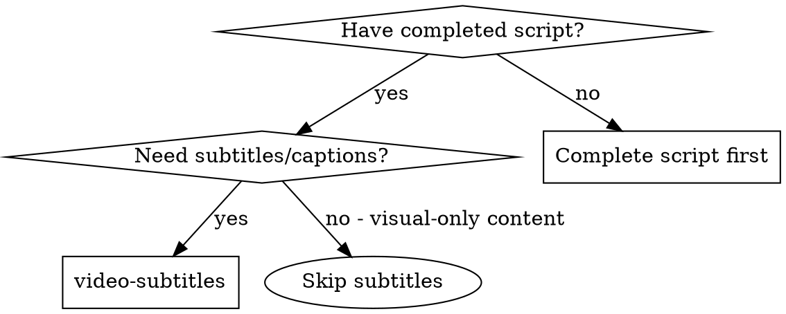

# Video Subtitles

## Overview

Create comprehensive multi-track subtitle systems optimized for 节映/剪映 (Jianying/CapCut), supporting primary dialogue, secondary translations, and emphasis tracks for maximum accessibility and viewer engagement.

<PREREQUISITE>
Must have a completed script from video-script before using this skill.
</PREREQUISITE>

**Core principle:** Multi-track subtitles enhance accessibility, comprehension, and engagement.

**Announce at start:** "I'm using the video-subtitles skill to create a comprehensive subtitle system for the video."

## When to Use



**Use when:**
- Script is complete and ready for subtitle creation
- Target audience includes non-native speakers
- Content needs accessibility support
- Publishing on platforms with auto-play (muted)
- Multi-language audience
- Educational content with key terminology

**Skip when:**
- Script not complete (use video-script first)
- Purely visual content with no dialogue
- Platform doesn't support subtitles

## The Process

### Step 1: Analyze Script for Subtitle Needs

1. Read the complete script
2. Identify all spoken content (narration, dialogue)
3. Mark key terminology and emphasis points
4. Note sections needing translation or clarification
5. Identify sound effects and non-spoken audio to caption

### Step 2: Design Subtitle Strategy

**Determine subtitle tracks needed:**

**Track 1: Primary Subtitles (Required)**
- Full dialogue/narration text
- Main language of the video
- Standard timing and readability

**Track 2: Secondary Translation (Optional)**
- Translation for bilingual audience
- Smaller text, secondary position
- Different color/style distinction

**Track 3: Emphasis/Definitions (Optional)**
- Key terminology definitions
- Important callouts
- Highlights and explanations
- Different visual treatment

**Subtitle Style Options:**

```markdown
**Style A: Clean & Professional**
- Font: Sans-serif (Helvetica, Arial, or system default)
- Size: Medium-large, highly readable
- Color: White with black outline
- Background: None or semi-transparent black
- Position: Bottom center, slight offset from edge

**Style B: Bold & Engaging**
- Font: Bold sans-serif
- Size: Large, dynamic
- Color: Bright brand color or yellow
- Background: Dark semi-transparent box
- Position: Lower third, slightly higher

**Style C: Minimal & Modern**
- Font: Thin sans-serif
- Size: Medium, clean
- Color: White with subtle shadow
- Background: None
- Position: Bottom center, clean spacing

**Style D: Animated & Dynamic**
- Font: Depends on brand, often custom
- Size: Varies by emphasis
- Color: Multiple colors for different speakers
- Background: Dynamic, changes with content
- Position: Varies, follows action
```

### Step 3: Create Primary Subtitle Track

For each scene with spoken content, create time-synced subtitles:

```markdown
## Scene N: Primary Subtitles

**Format:** SRT (SubRip) format for 节映/剪映 import

```
1
00:00:00,000 --> 00:00:03,500
Hey everyone! Are you struggling with productivity?

2
00:00:03,500 --> 00:00:06,000
In this video, I'll show you a simple solution.

3
00:00:06,000 --> 00:00:09,500
Let's dive in and get started.
```

**Timing Guidelines:**
- Maximum 2 seconds per subtitle for quick reading
- Break at natural phrases, not mid-word
- 1-2 seconds pause between related subtitles
- Allow time for complex information to be read
- Sync precisely with spoken audio

**Text Formatting:**
- Use proper punctuation and capitalization
- Include speaker labels if multiple speakers
- Use italics for off-screen or voice-over
- Use [brackets] for sound effects: [door opens]
- Keep lines under 42 characters for readability

**Character Limits:**
- Single line: Maximum 42 characters
- Two lines: Maximum 32 characters per line
- Preferred: One line when possible
- Break at logical phrase boundaries

**Example:**
```
Original: "Hey everyone! Are you struggling with productivity? In this video, I'll show you a simple solution. Let's dive in and get started."

Subtitle 1: Hey everyone! Are you struggling
Subtitle 2: with productivity?
Subtitle 3: In this video, I'll show you
Subtitle 4: a simple solution.
Subtitle 5: Let's dive in and get started.
```
```

### Step 4: Create Secondary Translation Track (Optional)

For bilingual content or translation support:

```markdown
## Scene N: Secondary Translation (English/Chinese)

**Format:** SRT format with language indicator

**Visual Style:**
- Font: Same as primary but smaller
- Color: Different color (e.g., cyan for Chinese)
- Position: Above primary subtitles
- Background: None or minimal

```
1
00:00:00,000 --> 00:00:03,500
大家好！你是否在为工作效率而烦恼？

2
00:00:03,500 --> 00:00:06,000
在这个视频中，我将向你展示一个简单的解决方案。

3
00:00:06,000 --> 00:00:09,500
让我们开始吧。
```

**Translation Guidelines:**
- Maintain meaning, not word-for-word translation
- Adapt cultural references appropriately
- Match timing to primary audio
- Keep similar line lengths
- Use natural phrasing in target language
- Consider regional variations if applicable

**Bilingual Layout Options:**

**Option 1: Stacked (Primary on bottom, Secondary above)**
```
Secondary translation (smaller, different color)
Primary subtitle (larger, main color)
```

**Option 2: Side-by-side**
```
Primary | Secondary
```

**Option 3: Alternating Scenes**
- Scene A: Primary only
- Scene B: Secondary only
- Use for language learning content
```

### Step 5: Create Emphasis/Definitions Track (Optional)

For educational content or complex terminology:

```markdown
## Scene N: Emphasis & Definitions Track

**Format:** SRT format with special markers

**Visual Style:**
- Font: Bold, distinctive
- Color: Highlight color (yellow, cyan)
- Position: Near relevant action on screen
- Background: Semi-transparent box
- Animation: Pop-in or fade-in

**Purpose:** Define key terms, emphasize important points, provide context

```
1
00:01:23,000 --> 00:01:28,000
API: Application Programming Interface
Allows different software systems to communicate

2
00:02:15,000 --> 00:02:19,000
Pro Tip: Keyboard shortcuts save time!
Press Cmd+K for quick actions

3
00:03:45,000 --> 00:03:50,000
⚠️ Warning: Always save before closing!
Unsaved changes will be lost
```

**Emphasis Types:**

**Type 1: Term Definitions**
- Format: "TERM: Definition"
- Use: When introducing new terminology
- Timing: Appears when term is spoken, stays 2-3 seconds

**Type 2: Pro Tips**
- Format: "💡 Pro Tip: [Advice]"
- Use: Highlight expert advice or best practices
- Timing: Appears with tip, stays 3-4 seconds

**Type 3: Warnings**
- Format: "⚠️ Warning: [Caution]"
- Use: Critical warnings or important cautions
- Timing: Appears with warning, stays 3-4 seconds

**Type 4: Key Takeaways**
- Format: "✓ Key Point: [Summary]"
- Use: Summarize important concepts
- Timing: Appears at end of section, stays 4-5 seconds

**Type 5: Statistics/Data**
- Format: "📊 [Data point]"
- Use: Highlight important numbers or statistics
- Timing: Appears when mentioned, stays 2-3 seconds
```

### Step 6: Create Audio Description Track (Optional)

For accessibility and visually impaired viewers:

```markdown
## Scene N: Audio Description Track

**Format:** SRT format with AD markers

**Purpose:** Describe visual elements, actions, and scene changes

**Timing Guidelines:**
- Insert during natural pauses in dialogue
- 3-5 seconds maximum per description
- Don't overlap important dialogue

```
1
00:00:05,000 --> 00:00:08,000
[AD: The presenter appears on screen, smiling at the camera]

2
00:00:12,000 --> 00:00:15,000
[AD: Screen recording shows the application dashboard]

3
00:00:25,000 --> 00:00:28,000
[AD: An animated graph appears, showing an upward trend]

4
00:01:30,000 --> 00:01:34,000
[AD: Scene transitions to close-up of hands typing on keyboard]
```

**Audio Description Guidelines:**
- Describe important visual information
- Note scene changes and transitions
- Identify on-screen text and graphics
- Describe actions and movements
- Mention facial expressions if relevant to content
- Keep descriptions concise and factual
- Use present tense: "shows," "appears," "displays"
```

### Step 7: Format for 节映/剪映 Import

**节映/剪映 Subtitle Format Support:**

**Option 1: SRT Import (Recommended)**
- Universal format, widely supported
- Easy to create and edit
- Imports directly into 节映/剪映
- Can be edited after import

**Option 2: 节映/剪映 Native Format**
- JSON-based format for advanced control
- Supports styling and positioning
- More complex to create manually
- Best for automated generation

**Option 3: Manual Entry in 节映/剪映**
- Type directly into 节映/剪映 subtitle editor
- Time-consuming but precise control
- Good for short videos or corrections
- Use for final adjustments

**Export Structure:**

```markdown
## Subtitle Export Package

### File Structure
```
project-name/
├── subtitles/
│   ├── primary-track.srt          # Main subtitles
│   ├── secondary-track.srt        # Translation (if needed)
│   ├── emphasis-track.srt         # Emphasis (if needed)
│   ├── audio-description-track.srt # AD (if needed)
│   └── subtitle-specs.md          # Style and timing guide
```

### SRT File Format Example (primary-track.srt)
```
1
00:00:00,000 --> 00:00:03,500
Hey everyone! Are you struggling with productivity?

2
00:00:03,500 --> 00:00:06,000
In this video, I'll show you a simple solution.

3
00:00:06,000 --> 00:00:09,500
Let's dive in and get started.
```
```

### Step 8: Subtitle Style Guide for 节映/剪映

```markdown
## 节映/剪映 Subtitle Style Specifications

### Primary Track Settings
- **Font:** System Default / Helvetica
- **Size:** 18-22 (scale 0.8-1.0)
- **Color:** #FFFFFF (White)
- **Outline:** #000000 (Black), 2px
- **Background:** None or semi-transparent black (opacity 30%)
- **Position:** Bottom center, Y: 85%
- **Alignment:** Center
- **Line Spacing:** 1.2
- **Animation:** Fade in/out (0.2s)

### Secondary Track Settings
- **Font:** Same as primary
- **Size:** 14-16 (scale 0.6-0.7)
- **Color:** #00FFFF (Cyan) or #FFD700 (Gold)
- **Outline:** #000000 (Black), 2px
- **Background:** None
- **Position:** Above primary, Y: 75%
- **Alignment:** Center

### Emphasis Track Settings
- **Font:** Bold
- **Size:** 20-24 (scale 0.9-1.1)
- **Color:** #FFFF00 (Yellow)
- **Outline:** #000000 (Black), 3px
- **Background:** Semi-transparent black box (opacity 50%)
- **Position:** Dynamic, near relevant action
- **Alignment:** Center or Left
- **Animation:** Pop in (scale 0.8 → 1.0, 0.3s)

### Reading Speed Guidelines
- **Maximum:** 150 words per minute
- **Optimal:** 120-130 words per minute
- **Allow extra time for:** Numbers, technical terms, complex sentences
```

## Best Practices

**For readability:**
- Break at natural phrase boundaries
- Keep lines balanced in length
- Use proper punctuation and capitalization
- Avoid more than 2 lines per subtitle
- Allow sufficient reading time

**For timing:**
- Sync precisely with audio
- Avoid overlapping important dialogue
- Allow pauses between related subtitles
- Consider reading speed for complexity
- Test timing at normal playback speed

**For multi-track:**
- Maintain visual hierarchy between tracks
- Use distinct colors/styles for each track
- Don't overcrowd the screen
- Consider when each track is necessary
- Test all tracks together for clarity

**For accessibility:**
- Include speaker identification
- Caption important sound effects
- Provide audio descriptions if needed
- Ensure high contrast for readability
- Test with accessibility tools

## Common Mistakes

**Avoid:**
- Subtitles that are too long to read comfortably
- Breaking words across lines awkwardly
- Poor timing that doesn't match audio
- Ignoring reading speed for complex content
- Forgetting to subtitle sound effects
- Using low contrast colors
- Overlapping subtitles from different tracks
- Inconsistent styling throughout video

**Instead:**
- Keep subtitles concise and readable
- Break at natural phrase boundaries
- Sync timing precisely to audio
- Allow extra time for complex information
- Include sound effects in brackets
- Use high contrast colors
- Stagger subtitle tracks to avoid overlap
- Maintain consistent style throughout

## Output Format

Produce these outputs:

### 1. Subtitle Files
SRT format files for each track:
- `primary-track.srt`
- `secondary-track.srt` (if needed)
- `emphasis-track.srt` (if needed)
- `audio-description-track.srt` (if needed)

### 2. Subtitle Specifications
Detailed style and timing guide:
```markdown
# Subtitle Specifications for [Project Name]

## Tracks Included
- Primary: [Language]
- Secondary: [Language] (if applicable)
- Emphasis: Yes/No
- Audio Description: Yes/No

## Style Settings
[Detailed style specifications for each track]

## Special Notes
[Timing considerations, special cases, etc.]

## Testing Checklist
- [ ] All tracks tested together
- [ ] Timing verified at normal speed
- [ ] Readability tested on target device
- [ ] Colors tested for contrast
- [ ] Multi-language verified (if applicable)
```

### 3. 节映/剪映 Import Instructions
Step-by-step guide for importing subtitles:
```markdown
# Importing Subtitles into 节映/剪映

## Method 1: Direct SRT Import
1. Open project in 节映/剪映
2. Go to Text > Subtitles
3. Click "Import SRT"
4. Select subtitle file
5. Adjust timing if needed
6. Style as per specifications

## Method 2: Copy-Paste
1. Open SRT file in text editor
2. Copy all content
3. Paste into 节映/剪映 subtitle editor
4. Review and adjust timing

## Styling in 节映/剪映
1. Select subtitle track
2. Apply style settings from specifications
3. Preview at full speed
4. Make final adjustments
```

## Integration

**Use after:**
- **superpowers-video:video-script** - Script needed for subtitle content

**Use before:**
- **superpowers-video:video-effects** - Subtitles inform effects and transitions

**Works with:**
- Any video with spoken content
- Educational and tutorial content
- Multi-language audiences
- Accessibility requirements
- Social media content (auto-play environments)

## Remember

- Subtitles are essential for accessibility
- Multi-track serves different viewer needs
- Timing must be precise
- Readability is more important than word-for-word accuracy
- Style should match video aesthetic
- Test on target platforms
- Consider viewers watching without sound
- Plan for 节映/剪映's subtitle capabilities

## Checklist

- [ ] Analyzed script for subtitle needs
- [ ] Determined required subtitle tracks
- [ ] Created primary subtitle track (SRT format)
- [ ] Created secondary translation track (if needed)
- [ ] Created emphasis track (if needed)
- [ ] Created audio description track (if needed)
- [ ] Verified timing for all tracks
- [ ] Checked readability and character limits
- [ ] Created style specifications document
- [ ] Tested multi-track compatibility
- [ ] Created 节映/剪映 import instructions
- [ ] Verified all subtitle files are properly formatted
- [ ] Confirmed accessibility requirements are met
- [ ] Tested subtitle display on target platform
