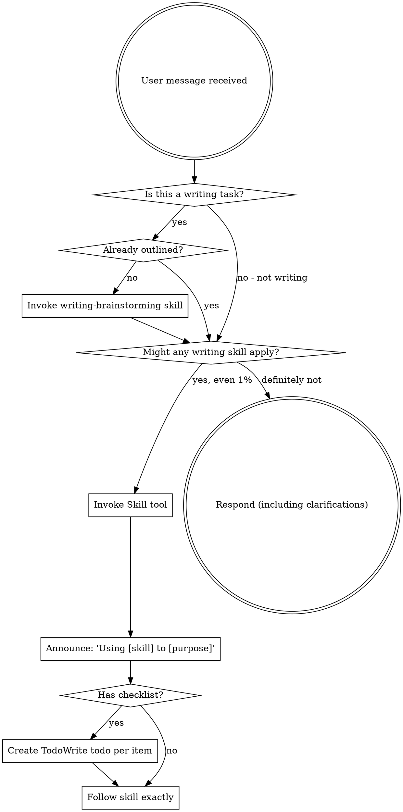

<EXTREMELY-IMPORTANT>
If you think there is even a 1% chance a writing skill might apply to what you're doing, you ABSOLUTELY MUST invoke the skill.

IF A WRITING SKILL APPLIES TO YOUR TASK, YOU DO NOT HAVE A CHOICE. YOU MUST USE IT.

This is not negotiable. This is not optional. You cannot rationalize your way out of this.
</EXTREMELY-IMPORTANT>

## How to Access Writing Skills

**In Claude Code:** Use the `Skill` tool. When you invoke a skill, its content is loaded and presented to you—follow it directly. Never use the Read tool on skill files.

**In other environments:** Check your platform's documentation for how skills are loaded.

# Using Writing Skills

## The Rule

**Invoke relevant writing skills BEFORE any writing or content creation.** Even a 1% chance a writing skill might apply means that you should invoke the skill to check. If an invoked skill turns out to be wrong for the situation, you don't need to use it.

## Writing Skills Available

### Process Skills (Use First)

**superpowers-writer:writing-brainstorming**
- Use when: Starting any writing project
- What: Explores purpose, audience, structure before drafting
- Output: Approved outline

### Execution Skills (Use After Brainstorming)

**superpowers-writer:writing-execution**
- Use when: You have an approved outline and need to write content
- What: Writes content section-by-section with review checkpoints
- Output: Complete draft

### Review Skills (Use After Drafting)

**superpowers-writer:writing-review**
- Use when: Reviewing written content for quality
- What: Systematic review across structure, clarity, style, grammar, effectiveness
- Output: Comprehensive feedback with prioritized improvements

## Red Flags

These thoughts mean STOP—you're rationalizing:

| Thought | Reality |
|---------|---------|
| "This is just a quick email" | Quick emails benefit from structure. Check for skills. |
| "I don't need a plan for this" | Every piece of writing benefits from planning. Check first. |
| "I'll just write it and see" | Writing without planning = rework. Skills prevent this. |
| "This doesn't need an outline" | Even simple content needs structure. Check first. |
| "I know what to write" | Knowing ≠ executing well. Skills ensure quality. |
| "The skill is overkill" | "Overkill" content becomes simpler with structure. Use it. |
| "I've written this type before" | Each piece is unique. Skills ensure consistency. |
| "I'll review it at the end" | Late review = expensive rework. Checkpoints prevent this. |
| "This feels productive" | Undisciplined writing wastes time. Skills prevent this. |
| "I don't need help with writing" | Everyone benefits from structured process. Use skills. |

## Writing Skill Priority

When multiple writing skills could apply, use this order:

1. **Process skills first** (writing-brainstorming) - determines WHAT you're writing and structure
2. **Execution skills second** (writing-execution) - guides the actual writing
3. **Review skills third** (writing-review) - ensures quality

"Write a blog post" → writing-brainstorming first, then writing-execution, then writing-review.

"Review this draft" → writing-review directly.

"Write from this outline" → writing-execution.

## Skill Types

**Rigid** (writing-brainstorming): Follow exactly. The hard gate exists for a reason.

**Flexible** (writing-review): Adapt the review dimensions to the content type and context.

The skill itself tells you which.

## What Counts as a Writing Task

**Definitely writing tasks (use skills):**
- Blog posts, articles, essays
- Documentation, guides, tutorials
- Emails, newsletters, announcements
- Reports, whitepapers, case studies
- Social media content, marketing copy
- Presentations, speeches, scripts
- Stories, creative writing
- Technical documentation, API docs
- Product descriptions, listings

**Borderline (check if skills apply):**
- Quick messages/Slack messages
- Comments in code
- Configuration file comments
- README files
- Meeting notes
- Bug reports
- Pull request descriptions

**Probably not writing (use other skills):**
- Code implementation
- System debugging
- Data analysis
- Architecture design (use brainstorming)
- Testing (use test-driven-development)

## User Instructions

Instructions say WHAT, not HOW. "Write a blog post about X" or "Create documentation for Y" doesn't mean skip the writing workflow.

The workflow exists to ensure:
- Clear purpose and audience before drafting
- Structured approach prevents wasted effort
- Checkpoints catch issues early
- Systematic review ensures quality

## Integration with Development Skills

Writing skills complement development skills:

**When writing documentation:**
1. Use development brainstorming for architecture understanding
2. Use writing-brainstorming for content structure
3. Use writing-execution for drafting
4. Use writing-review for quality

**When creating README/docs alongside code:**
1. Development skills for the code
2. Writing skills for the documentation

They work together, not in competition.

## The Bottom Line

**Writing = Development**

Both require:
- Planning before execution
- Structure before substance
- Checkpoints during execution
- Systematic review before completion

If you use development skills for code, use writing skills for content. Same discipline, different domain.
