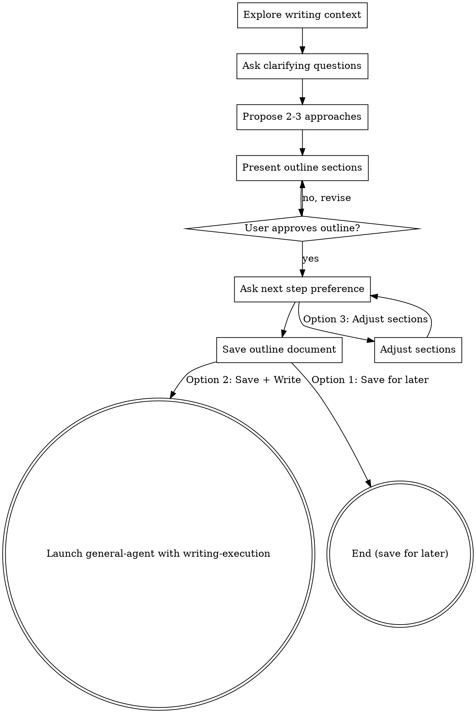

# Writing Brainstorming

## Overview

Help turn writing ideas into fully formed outlines and content plans through natural collaborative dialogue.

Start by understanding the writing context, then ask questions one at a time to refine the concept. Once you understand what you're writing, present the outline section by section with incremental validation, then present the complete outline and ask next step preference.

<HARD-GATE>
Do NOT start drafting, writing content, or creating any actual text until you have presented a complete outline. This applies to EVERY writing task regardless of perceived simplicity.

After presenting the complete outline, you must ask the user to choose between: (1) save for later, (2) save+write now, or (3) adjust sections. Only launch writing-execution if user chooses Option 2.
</HARD-GATE>

## Anti-Pattern: "This Is Too Simple To Need An Outline"

Every writing project goes through this process. A quick email, a blog post, a technical document — all of them. "Simple" writing is where unexamined assumptions cause the most wasted effort. The outline can be short (3-5 bullet points for truly simple pieces), but you MUST present it before asking what to do next.

## Checklist

You MUST create a task for each of these items and complete them in order:

1. **Explore writing context** — understand purpose, format, medium, constraints
2. **Ask clarifying questions** — one at a time, understand audience/tone/goals/success criteria
3. **Propose 2-3 approaches** — with trade-offs and your recommendation
4. **Present outline sections** — scaled to complexity, get user approval after each section
5. **Present final outline** — complete outline with total word count, no confirmation needed
6. **Ask next step preference** — offer 3 options: save for later / save+write / adjust sections
7. **Execute user's choice** — save outline, optionally launch writing subagent

## Process Flow



**After outline approval, ask user to choose next step:**
- **Option 1:** Save outline as document for later writing
- **Option 2:** Save outline + launch general-agent with writing-execution skill
- **Option 3:** Adjust certain sections of the outline

## The Process

**Understanding the writing task:**

- Check the current context first (existing content, target medium, constraints)
- Ask questions one at a time to refine the concept
- Prefer multiple choice questions when possible, but open-ended is fine too
- Only one question per message - if a topic needs more exploration, break it into multiple questions
- Focus on understanding: purpose, audience, tone, format, success criteria

**Key questions to explore:**

- **Purpose:** What are you trying to achieve? Inform, persuade, entertain, instruct?
- **Audience:** Who will read this? What's their background? What do they already know?
- **Format:** Blog post, email, report, documentation, story, essay?
- **Tone:** Formal, casual, technical, friendly, authoritative?
- **Length:** Short-form (<500 words), medium (500-1500), long-form (1500+)?
- **Constraints:** Deadlines, word limits, style guides, brand guidelines?
- **Success criteria:** What makes this piece successful? What should reader do/think/feel?

**Exploring approaches:**

- Propose 2-3 different approaches with trade-offs
- Present options conversationally with your recommendation and reasoning
- Lead with your recommended option and explain why

**Presenting the outline:**

- Once you understand what you're writing, present the outline section by section
- Scale each section to its complexity: bullet points if straightforward, detailed structure if nuanced
- Ask after each section whether it looks right so far (incremental validation)
- After all sections are shown, present the complete outline with total word count
- No final confirmation needed - proceed directly to asking next step preference
- Cover: introduction, main sections, key points, conclusion, call-to-action
- Be ready to go back and clarify if something doesn't make sense

## After the Outline

**Get user's next step preference:**

After presenting the complete outline, present three options:

```
Your outline is complete! What would you like to do next?

1. Save for later - Save the outline as a document to work on later
2. Save + Write now - Save outline and launch a general-agent subagent with writing-execution skill to write the content
3. Adjust sections - Modify certain parts of the outline before proceeding

Which option would you prefer?
```

**Option 1: Save for later**

- Write the outline to appropriate location (depends on project)
- For articles/posts: Save as `outline.md` or `draft-outline.md`
- For documentation: Save in `docs/outlines/` directory
- For code/docs: Save alongside relevant code
- End the brainstorming session

**Option 2: Save + Write now**

- First save the outline to appropriate location (see Option 1)
- Ask the user "Are you ready for me to launch a general-agent subagent with the writing-execution skill to write this content?"
- Wait for user confirmation before proceeding
- Launch a general-agent subagent with the writing-execution skill loaded ONLY after user confirms
- The subagent will use the approved outline to create the actual content
- Do NOT start writing content directly in this session
- Delegation to general-agent with writing-execution is the next step

**Option 3: Adjust sections**

- Ask which sections need adjustment
- Present the current outline and allow user to specify changes
- After adjustments are made, loop back to asking next step preference
- User can choose Option 1 or 2 after adjustments are complete

## Key Principles

- **One question at a time** - Don't overwhelm with multiple questions
- **Multiple choice preferred** - Easier to answer than open-ended when possible
- **YAGNI ruthlessly** - Remove unnecessary sections from all outlines
- **Explore alternatives** - Always propose 2-3 approaches before settling
- **Incremental validation** - Present outline sections with check-ins, then complete outline
- **Be flexible** - Go back and clarify when something doesn't make sense

## Example Workflow

**User:** "I need to write a blog post about microservices"

**You:** Let me understand this better first.

[Check if there's existing content, target blog, constraints]

**Question 1:** What's the main goal of this post?

**Options:**
1. Help developers decide if microservices are right for them
2. Teach how to implement microservices step-by-step
3. Share lessons learned from a microservices migration
4. Something else?

**User:** "Option 1 - help them decide"

**Question 2:** Who's your target audience?

**Options:**
1. Junior developers (0-2 years experience)
2. Mid-level developers (3-5 years)
3. Senior developers and architects (5+ years)
4. Mixed technical audience

**User:** "Option 3 - senior developers and architects"

**Question 3:** What tone should this have?

**Options:**
1. Opinionated and provocative
2. Balanced and analytical
3. Practical and hands-on
4. Academic and research-based

**User:** "Option 2 - balanced and analytical"

[Continue exploring...]

**You:** Great, I understand now. Here's my recommended approach:

**Approach 1 (Recommended):** Decision framework with pros/cons
- Provides structured way to evaluate microservices
- Includes real-world trade-offs
- Helps readers make informed decisions
- ~1500 words

**Approach 2:** Case study comparison
- Shows monolith vs microservices in practice
- More concrete but less broadly applicable
- ~2000 words

**Approach 3:** Checklist-based guide
- Quick and actionable
- Less depth, more speed
- ~800 words

**My recommendation:** Approach 1, because it balances depth with applicability and gives readers a reusable framework.

**User:** "Let's go with approach 1"

**You:** Perfect. Here's the outline:

**Section 1: Introduction** (~150 words)
- Hook: The microservices promise vs reality
- What this post covers (decision framework)
- Who should read this

Does this structure look right so far?

**User:** "Yes"

**You:**

**Section 2: When Microservices Make Sense** (~400 words)
- Clear benefits (scalability, team autonomy, deployment flexibility)
- Ideal scenarios (complex domains, multiple teams, scaling needs)
- Success indicators

**Section 3: The Hidden Costs** (~400 words)
- Distributed systems complexity
- Operational overhead
- Data consistency challenges
- Network latency and failure modes

**Section 4: Decision Framework** (~300 words)
- Questions to ask before committing
- Red flags that mean "don't do it"
- Green lights that indicate "go for it"

**Section 5: Conclusion** (~150 words)
- Summary of key points
- Recommendation: start with monolith, split when needed
- Call to action: share your microservices experience

Total: ~1400 words

**You:** Your outline is complete! What would you like to do next?

**Options:**
1. **Save for later** - Save the outline as a document to work on later
2. **Save + Write now** - Save outline and launch a general-agent subagent with writing-execution skill to write the content
3. **Adjust sections** - Modify certain parts of the outline before proceeding

**User:** "Option 2 - Save + Write now"

**You:** Excellent! Let me save the outline first.

[Save outline to appropriate location]

**You:** Outline saved to `docs/blog/microservices-outline.md`. Are you ready for me to launch a general-agent subagent with the writing-execution skill to write this article?

**User:** "Yes, I'm ready"

**You:** [Launch general-agent subagent with writing-execution skill loaded]
