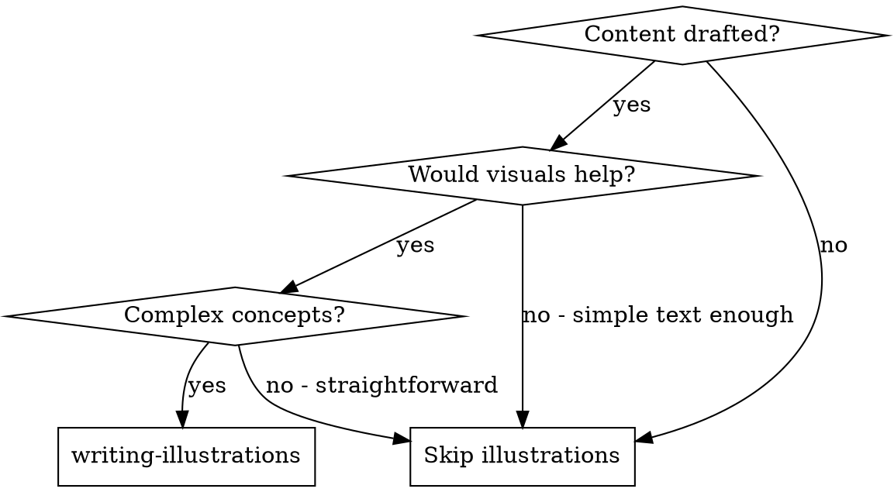

# Writing Illustrations

## Overview

Systematically identify where illustrations would enhance written content and provide detailed descriptions for each visual element. Works after writing-execution to add visual clarity and engagement.

**Core principle:** Strategic illustrations improve comprehension, retention, and engagement.

**Announce at start:** "I'm using the writing-illustrations skill to identify and describe illustrations for this content."

## When to Use



**Use when:**
- Content contains complex processes or workflows
- Explaining technical concepts or architectures
- Showing data relationships or comparisons
- Demonstrating step-by-step procedures
- Comparing before/after states
- Visualizing abstract concepts

**Skip when:**
- Content is simple and straightforward
- Text-only format is required
- No complex concepts to illustrate
- Pure narrative without technical content

## The Process

### Step 1: Read and Analyze Content

1. Read the complete draft
2. Identify sections that would benefit from illustrations
3. Mark potential illustration locations
4. Consider: What would be easier to understand visually?

### Step 2: Categorize Illustration Types

Different content needs different visual approaches:

**Process/Workflow:**
- Flowcharts
- Sequence diagrams
- Step-by-step visuals
- Decision trees

**Technical/Architecture:**
- System diagrams
- Component architecture
- Data flow diagrams
- Network topology

**Conceptual:**
- Infographics
- Concept maps
- Mental models
- Analogies visualized

**Data/Comparison:**
- Charts and graphs
- Tables (visual format)
- Before/after comparisons
- Side-by-side comparisons

**Procedural:**
- Step illustrations
- Screenshots with annotations
- Code flow diagrams
- UI mockups

### Step 2.5: Present Specification Plan

Before creating detailed specifications, present a specification plan to the user:

```markdown
## Illustration Specification Plan

I will create specifications for **[N]** illustrations:

**Priority 1 (Must-have):**
1. [Illustration 1 Title] - [Type: flowchart/diagram/etc.]
2. [Illustration 2 Title] - [Type]
3. [Illustration 3 Title] - [Type]

**Priority 2 (Nice-to-have):**
4. [Illustration 4 Title] - [Type]
5. [Illustration 5 Title] - [Type]

**Priority 3 (Optional):**
6. [Illustration 6 Title] - [Type]

**Process:**
- Create specifications one at a time
- Write each specification to file immediately
- After all specs complete, generate Priority 1 illustrations automatically
```

**Ask user:** "Does this specification plan look good? Should I proceed with creating the detailed specifications?"

**Wait for user confirmation before proceeding to Step 3.**

### Step 3: Create Illustration Specifications

Create detailed specifications **one at a time** and write each to file immediately.

**For each illustration (in priority order):**

1. **Announce current specification:**
   ```markdown
   **Creating specification [N]/[Total]: [Illustration Title]**

   **Type:** [flowchart/diagram/infographic/etc.]
   **Purpose:** [What this illustration will accomplish]
   ```

2. **Create detailed specification** using this template:

```markdown
## Illustration N: [Title]

**Location:** [Section name, after paragraph X]

**Purpose:** [What this illustration accomplishes]

**Type:** [Flowchart/Diagram/Infographic/Chart/etc.]

**Visual Content:**

[Detailed description of what the illustration should show]

**Elements:**

- [Element 1]: [Description, position, style]
- [Element 2]: [Description, position, style]
- [Element 3]: [Description, position, style]

**Layout:**

[Describe arrangement: left-to-right, top-to-bottom, circular, etc.]

**Style Guidelines:**

- Color scheme: [If applicable]
- Labels: [What text should appear]
- Annotations: [Key points to highlight]
- Emphasis: [What should stand out]

**Accessibility:**

- Alt text: [Brief description for screen readers]
- Text alternative: [How to describe if image unavailable]
```

3. **Write specification to file immediately:**
   - Append to `[content-title]-illustrations.md`
   - Use clear section headers for each illustration
   - File should grow incrementally as each spec is added

4. **Announce completion:**
   ```markdown
   ✓ Specification [N]/[Total] complete: [Illustration Title]
   ```

5. **Proceed to the next specification**

**After all specifications complete:**
- Confirm: "✓ All [N] illustration specifications created and saved to [filename]"
- Proceed to Step 3.5 for review

### Step 3.5: Review and Refine Specifications

Before generating illustrations, review all specifications to ensure they are complete and clear:

1. **Check completeness:**
   - Every specification has all required fields (Location, Purpose, Type, Visual Content, Elements, Layout, Style Guidelines, Accessibility)
   - No missing details that would require clarification

2. **Verify clarity:**
   - Visual descriptions are unambiguous
   - Technical terms are appropriate for the audience
   - Layout descriptions are specific enough for implementation

3. **Validate accessibility:**
   - All specifications include alt text
   - Text alternatives are provided
   - Color considerations noted for accessibility

4. **Consistency check:**
   - Style guidelines are consistent across illustrations
   - Terminology matches the rest of the content
   - Visual language aligns with brand guidelines

**If issues found:** Return to Step 3 to revise specifications before proceeding to Step 4.

### Step 4: Prioritize Illustrations

Not all illustrations are equally important:

**Must-have (Priority 1):**
- Critical for understanding core concepts
- Complex processes impossible to follow in text
- Key architectures or systems
- Essential data relationships

**Nice-to-have (Priority 2):**
- Enhances understanding but not critical
- Supplementary information
- Examples or case studies

**Optional (Priority 3):**
- Purely decorative
- Nice engagement elements
- Could be added later

### Step 5: Generate All Illustrations

After specifications are complete and verified, generate all Priority 1 illustrations directly:

**Preparation:**
1. Create images directory: `mkdir -p images`
2. Load all specifications from `[content-title]-illustrations.md`

**For each Priority 1 illustration specification:**

1. **Extract the visual prompt** from the specification:
   - Use the **Visual Content** section as the topic
   - Include **Type**, **Elements**, **Layout**, and **Style Guidelines** in the prompt

2. **Run the image generation script:**

```bash
# Basic usage
python scripts/test_gen_image.py "<visual-content-description>" --type illustration --output illustration-1.png

# With custom style (default: hand_drawn)
python scripts/test_gen_image.py "<visual-content-description>" --type illustration --style <style-name> --output illustration-1.png
```

3. **Image types available:**
   - `cover` - Cover/header images (typically wider aspect ratio)
   - `illustration` - Standard illustrations (default)
   - `thumbnail` - Small thumbnail images

4. **Verify the generated image:**
   - Check that the file was created successfully
   - Confirm the image matches the specification
   - Report any issues to the user

5. **Proceed to next illustration**

**Example:**

```bash
# Generate a system architecture diagram
python scripts/test_gen_image.py \
  "System architecture diagram showing three layers: presentation layer at top with UI components, business logic layer in middle with services, data layer at bottom with storage. Arrows showing data flow between layers. Clean technical style with blue color scheme." \
  --type illustration \
  --style technical \
  --output images/architecture-diagram.png
```

**Prompt Construction Guidelines:**

When building prompts for `test_gen_image.py`, combine these elements from your specification:

```bash
# Format: <topic> with <elements> in <layout> style. <style-guidelines>

# Example from a specification:
topic = "microservices architecture flow"
elements = "API gateway, service A, service B, database"
layout = "left-to-right flow with circular feedback"
style = "minimalist technical diagram, blue and gray colors"

# Constructed prompt:
python scripts/test_gen_image.py \
  "Microservices architecture flow showing API gateway routing to service A and service B, with circular feedback loop. Technical diagram style, minimalist design with blue and gray color scheme." \
  --type illustration \
  --output images/microservices-flow.png
```

**After generating all Priority 1 illustrations:**
- Confirm: "✓ All Priority 1 illustrations generated successfully"
- List all generated image files
- Ask: "Should I also generate Priority 2 (nice-to-have) illustrations?"
- If yes, generate Priority 2, then ask about Priority 3
- If no, proceed to Step 5.5

**Prompt Construction Guidelines:**

When building prompts for `test_gen_image.py`, combine these elements from your specification:

```bash
# Format: <topic> with <elements> in <layout> style. <style-guidelines>

# Example from a specification:
topic = "microservices architecture flow"
elements = "API gateway, service A, service B, database"
layout = "left-to-right flow with circular feedback"
style = "minimalist technical diagram, blue and gray colors"

# Constructed prompt:
python scripts/test_gen_image.py \
  "Microservices architecture flow showing API gateway routing to service A and service B, with circular feedback loop. Technical diagram style, minimalist design with blue and gray color scheme." \
  --type illustration \
  --output images/microservices-flow.png
```

**Important:**
- **DO NOT** use batch generation or shell scripts
- **DO NOT** generate multiple illustrations in parallel
- **MUST** generate one at a time and verify before proceeding
- **MUST** write each image to file before generating the next

### Step 5.5: Verify Generated Images

After generating all illustrations, perform quality assurance:

1. **Visual verification:**
   - Each image matches the specification requirements
   - Key elements are clearly visible and appropriately positioned
   - Text is readable at intended sizes
   - Color scheme matches style guidelines

2. **Technical verification:**
   - Images are properly sized and formatted
   - File names follow the established naming convention
   - Images are saved in the correct directory structure
   - No generation artifacts or errors

3. **Accessibility verification:**
   - Alt text accurately describes each image
   - Images don't rely solely on color for meaning
   - Text is sufficient for understanding if image unavailable

4. **Integration check:**
   - Images can be properly inserted into the target content
   - File paths work correctly in the markdown format
   - Image placement enhances rather than disrupts content flow

**If issues found:** Regenerate problematic images or adjust specifications and return to Step 5.

### Step 6: Insert Illustration Markers

Add markers in the content where illustrations should go:

```markdown
[ILLUSTRATION 1: System Architecture Diagram]
(See illustration specifications below)
Generated file: images/architecture-diagram.png

[Text continues after illustration...]
```

## Illustration Specification Template

### For Process/Workflow Diagrams

```markdown
## Illustration N: [Process Name] Flow

**Location:** [Section: Process Overview, after intro]

**Purpose:** Show how [process] works step-by-step

**Type:** Flowchart

**Visual Content:**

Start with [starting state] → [step 1] → [step 2] → [step 3] → [end state]

**Elements:**

- Start node: [Label], shape=[oval/rounded rectangle], color=[light green]
- Step 1: [Action], shape=[rectangle], color=[light blue]
- Decision: [Condition], shape=[diamond], color=[light yellow]
- End node: [Result], shape=[oval/rounded rectangle], color=[light red]

**Arrows:**

- Direction: [left-to-right/top-to-bottom]
- Labels: [Action verbs on arrows]
- Style: [Solid/dashed for different flow types]

**Annotations:**

- Callout 1: [Important note near step X]
- Callout 2: [Warning or tip near step Y]

**Accessibility:**

Alt text: "Flowchart showing [process] with [N] steps from [start] to [end]"
```

### For Architecture Diagrams

```markdown
## Illustration N: [System] Architecture

**Location:** [Section: System Design]

**Purpose:** Show how components in [system] relate to each other

**Type:** Architecture diagram

**Visual Content:**

[Top-level description of the system layout]

**Components:**

- Component A: [Name], function=[purpose], position=[top-left]
- Component B: [Name], function=[purpose], position=[center]
- Component C: [Name], function=[purpose], position=[bottom-right]

**Connections:**

- A → B: [Data/API type], label=[interaction description]
- B → C: [Data/API type], label=[interaction description]
- A ↔ C: [Bidirectional flow], label=[description]

**Layers/Tiers:**

- Layer 1 (top): [Presentation/UI components]
- Layer 2 (middle): [Business logic/services]
- Layer 3 (bottom): [Data/storage]

**Styling:**

- Boxes: [Shape, border style, fill color]
- External systems: [Different style to distinguish]
- Data flows: [Arrow style, line thickness]

**Accessibility:**

Alt text: "Architecture diagram showing [system] with [N] main components organized in [X] layers"
```

### For Data Visualizations

```markdown
## Illustration N: [Topic] Comparison

**Location:** [Section: Analysis/Results]

**Purpose:** Compare [metric A] vs [metric B] across [categories]

**Type:** [Bar chart/Line graph/Pie chart/Table]

**Data:**

| Category | Metric A | Metric B |
|----------|----------|----------|
| Cat 1    | Value    | Value    |
| Cat 2    | Value    | Value    |

**Visual Layout:**

- X-axis: [Categories]
- Y-axis: [Values/Metrics]
- Series: [A and B, different colors]
- Legend: [Position and labels]

**Emphasis:**

- Highlight: [Highest/lowest values]
- Annotations: [Key insights on the chart]
- Trend lines: [If showing patterns]

**Accessibility:**

Alt text: "[Chart type] comparing [metrics] showing [key insight]"
Data table: [Provided for screen readers]
```

### For Conceptual Illustrations

```markdown
## Illustration N: [Concept] Visualized

**Location:** [Section: Concept Explanation]

**Purpose:** Make [abstract concept] concrete through visual analogy

**Type:** [Infographic/Concept illustration]

**Visual Concept:**

[Describe the visual analogy or metaphor]

**Elements:**

- Main metaphor: [Describe the visual representation]
- Key parts: [How each part maps to the concept]
- Labels: [What text should appear]
- Relationships: [How parts connect]

**Color Coding:**

- Color 1: [Meaning/purpose]
- Color 2: [Meaning/purpose]
- Color 3: [Meaning/purpose]

**Accessibility:**

Alt text: "[Detailed description of the illustration and its meaning]"
Long description: [Extended explanation of visual metaphor]
```

## Best Practices

**For process diagrams:**
- Keep left-to-right or top-to-bottom flow
- Use consistent shapes for same element types
- Label all arrows and decisions clearly
- Include start and end states
- Show feedback loops if applicable

**For architecture diagrams:**
- Group related components
- Show clear boundaries (systems, layers, services)
- Distinguish internal vs external components
- Label all connections and data flows
- Include key protocols or APIs

**For data visualizations:**
- Choose right chart type for the data
- Label axes and legend clearly
- Use color consistently
- Highlight key insights
- Always provide data table for accessibility

**For conceptual illustrations:**
- Use familiar analogies
- Keep visuals simple and clear
- Explain the metaphor in text
- Connect visual elements to concepts explicitly
- Test with non-experts

## Common Mistakes

**Avoid:**

- Overloading illustrations with too much detail
- Using inconsistent visual language
- Skipping alt text or accessibility
- Creating visuals that require explanation
- Using color as only differentiator (accessibility issue)
- Making text too small to read
- Cluttering with unnecessary elements

**Instead:**

- Focus on one key idea per illustration
- Use consistent style throughout
- Provide text alternatives
- Make visuals self-explanatory
- Use multiple cues (color + shape + labels)
- Ensure text is readable at size
- Include only essential elements

## Output Format

Produce three outputs:

### 1. Annotated Content

Content with illustration markers inserted:

```markdown
# [Content Title]

[Introduction paragraph]

[ILLUSTRATION 1: System Architecture]


This system consists of three main components...

[ILLUSTRATION 2: Data Flow Diagram]


The data flows through these components...
```

### 2. Illustration Specifications Document

Detailed specifications for each illustration (using templates above).

Save as: `[content-title]-illustrations.md`

### 3. Generated Images

All illustration images generated using `scripts/test_gen_image.py`:

```bash
# Example output structure
images/
├── illustration-1-architecture.png
├── illustration-2-data-flow.png
├── illustration-3-process-flow.png
└── illustration-4-comparison.png
```

**Include in documentation:**
- Image file paths for each illustration
- Prompt used for each image (for reproducibility)
- Any generation notes or issues

## Integration

**Use after:**
- **superpowers-writer:writing-execution** - After drafting is complete

**Use before:**
- **superpowers-writer:writing-review** - Review content with illustrations included

**Can be used with:**
- Any content type that would benefit from visuals
- Technical documentation
- Blog posts and articles
- Presentations and slide decks
- Educational materials

## Remember

- Illustrations should clarify, not decorate
- Each illustration needs a clear purpose
- Provide detailed specifications for creators
- Always include accessibility (alt text, text alternatives)
- Prioritize illustrations by importance
- Keep visual language consistent
- **ALWAYS present specification plan to user before creating specs (Step 2.5)**
- **Create specifications ONE AT A TIME and write each to file immediately (Step 3)**
- **After all specs complete, generate all Priority 1 illustrations automatically (Step 5)**
- **Ask user confirmation only before generating Priority 2 and 3 illustrations**
- **Generate actual images using scripts/test_gen_image.py**
- **Save generated images in a dedicated images/ directory**
- **Document prompts used for reproducibility**

## Checklist

- [ ] Read and analyzed complete draft
- [ ] Identified all illustration opportunities
- [ ] Categorized illustration types appropriately
- [ ] **Presented specification plan to user and got approval (Step 2.5)**
- [ ] **Created detailed specifications ONE AT A TIME (Step 3)**
- [ ] **Wrote each specification to file immediately after creation**
- [ ] Included accessibility information (alt text, etc.)
- [ ] Reviewed and refined all specifications (Step 3.5)
- [ ] Prioritized illustrations by importance (Step 4)
- [ ] **Generated all Priority 1 illustrations using scripts/test_gen_image.py (Step 5)**
- [ ] **Got user confirmation before generating Priority 2 and 3 illustrations**
- [ ] Verified all generated images match specifications
- [ ] Inserted illustration markers with file paths in content
- [ ] Verified illustrations enhance understanding

## Image Generation Quick Reference

```bash
# Generate single illustration
python scripts/test_gen_image.py "<topic description>" --type illustration -o images/output.png

# Generate with specific style
python scripts/test_gen_image.py "<topic description>" --type illustration --style technical -o images/output.png

# Generate cover image
python scripts/test_gen_image.py "<cover topic>" --type cover -o images/cover.png

# Available styles (check styles/image/ directory)
# - hand_drawn (default)
# - technical
# - minimal
# - colorful
# - etc.
```
