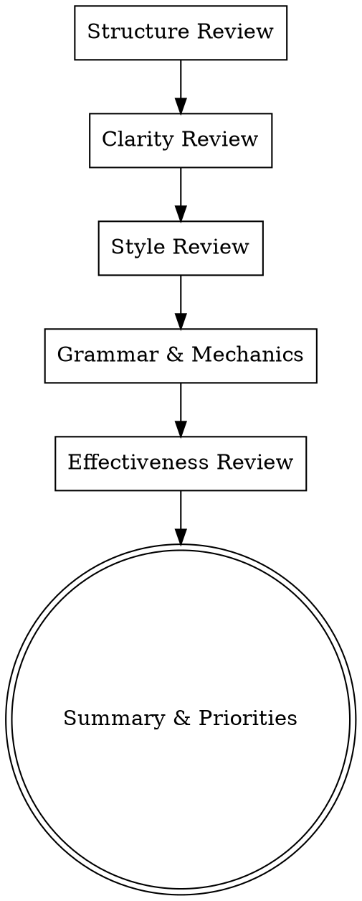

# Writing Review

## Overview

Systematically review written content across multiple dimensions: structure, clarity, style, grammar, and effectiveness. Provide actionable feedback with specific examples and suggestions.

**Core principle:** Comprehensive, actionable review that makes content better.

**Announce at start:** "I'm using the writing-review skill to review this content."

## Review Dimensions

Review content across these dimensions in order:



## 1. Structure Review

**What to check:**
- **Logical flow** - Do ideas progress naturally?
- **Section organization** - Is content grouped logically?
- **Transitions** - Do smooth connections exist between ideas/sections?
- **Introduction** - Does it effectively set up the content?
- **Conclusion** - Does it provide closure and call-to-action?
- **Balance** - Is attention appropriately distributed across sections?

**What to report:**
- Sections that need reordering
- Missing transitions (be specific: "between section 2 and 3")
- Weak or missing introduction/conclusion
- Sections that are too long or too short

## 2. Clarity Review

**What to check:**
- **Ambiguity** - Are there unclear statements?
- **Jargon** - Is technical language explained?
- **Assumptions** - Does the text assume knowledge reader may not have?
- **Concreteness** - Are abstract ideas supported with examples?
- **Sentence complexity** - Are there sentences that are hard to parse?

**What to report:**
- Unclear statements (quote them)
- Jargon that needs explanation
- Places where examples would help
- Sentences that need simplifying

## 3. Style Review

**What to check:**
- **Tone consistency** - Does voice remain consistent throughout?
- **Active vs passive** - Is active voice used where appropriate?
- **Sentence variety** - Is there mix of sentence lengths?
- **Paragraph structure** - Are paragraphs focused and well-paced?
- **Word choice** - Are words precise and appropriate for audience?

**What to report:**
- Tone inconsistencies (quote examples)
- Overuse of passive voice
- Monotonous sentence structure
- Weak word choices with better alternatives

## 4. Grammar & Mechanics

**What to check:**
- **Spelling** - Any typos or misspellings?
- **Grammar** - Subject-verb agreement, verb tense consistency
- **Punctuation** - Proper use of commas, semicolons, dashes
- **Capitalization** - Consistent and correct
- **Formatting** - Headers, lists, emphasis used correctly?

**What to report:**
- Specific errors with line/paragraph references
- Patterns of errors (not just individual instances)
- Formatting issues

## 5. Effectiveness Review

**What to check:**
- **Goal achievement** - Does content accomplish its purpose?
- **Audience appropriateness** - Is it right for the intended readers?
- **Engagement** - Is it interesting? Will audience care?
- **Persuasiveness** - If persuasive, are arguments compelling?
- **Actionability** - Does reader know what to do next?

**What to report:**
- Gap between intended and actual effect
- Weak arguments or evidence
- Missing call-to-action
- Areas that will lose reader interest

## Review Format

Organize your review as follows:

```markdown
# Content Review: [Title]

## Summary

[2-3 sentence overview of overall quality]

## Priority Issues

[Fix these first]

1. **[Category]** - [Issue description]
   - Location: [Section/paragraph reference]
   - Impact: [Why this matters]
   - Suggestion: [Specific fix]

## Detailed Review by Dimension

### Structure
- [Issue 1]
- [Issue 2]

### Clarity
- [Issue 1]
- [Issue 2]

### Style
- [Issue 1]
- [Issue 2]

### Grammar & Mechanics
- [Issue 1]
- [Issue 2]

### Effectiveness
- [Issue 1]
- [Issue 2]

## Strengths

[What works well - acknowledge good writing]

## Recommended Next Steps

1. [Priority 1]
2. [Priority 2]
3. [Priority 3]
```

## Review Principles

**Be specific:**
- Quote the exact text you're referencing
- Provide line/paragraph references
- Give concrete examples of issues

**Be constructive:**
- Explain why something is a problem
- Provide specific suggestions for fixes
- Offer alternatives when possible

**Be balanced:**
- Acknowledge what works well
- Don't overwhelm with minor issues
- Prioritize by impact

**Be actionable:**
- Each issue should have clear fix
- Group related issues together
- Provide revision order (most critical first)

## Common Writing Issues

**Watch for these patterns:**

**Structure Issues:**
- Buried lead (main point too late)
- Weak transitions between sections
- Unrelated ideas in same paragraph
- Missing conclusion or call-to-action

**Clarity Issues:**
- Passive voice hiding responsibility
- Nominalizations (verbs turned into nouns)
- Overly complex sentence structures
- Missing context for examples

**Style Issues:**
- Inconsistent tone (formal then casual)
- Repeated sentence openings
- Weak verbs (is, are, was, were)
- Wordy phrases (can be shorter)

**Grammar Issues:**
- Subject-verb disagreement
- Pronoun reference errors
- Misused commas
- Inconsistent verb tenses

## Remember

- Review systematically, not randomly
- Be specific and constructive
- Prioritize by impact
- Acknowledge strengths
- Provide actionable feedback
- Suggest revision order

## Integration

**Use after:**
- **superpowers-writer:writing-execution** - Review completed drafts
- **superpowers-writer:writing-plans** - Review plans before execution

**Use with:**
- Any content type (blog posts, documentation, emails, reports, stories)
